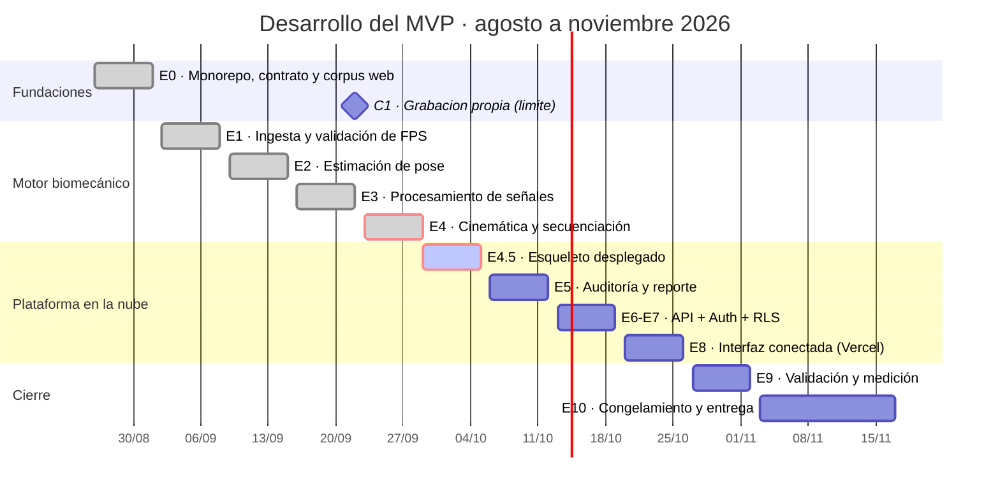

# Plan de Desarrollo por Etapas — KinetiQ

**Sistema de análisis biomecánico preventivo para tenis mediante visión artificial**
Proyecto Final de Ingeniería en Informática · Universidad del Salvador
Ventana de desarrollo: 26 de agosto — 17 de noviembre de 2026 (12 semanas)

---

## Cómo usar este documento

Este archivo va en `docs/plan-desarrollo.md` dentro del repositorio, junto al `CLAUDE.md`.

**Regla de trabajo con Claude Code: una etapa por sesión.** Al iniciar cada sesión, indicar
qué etapa se va a abordar y pedir primero un plan de implementación antes de escribir código.
Revisar ese plan, aprobarlo y recién entonces avanzar. Ninguna etapa comienza si la anterior
no cumplió su criterio de aceptación.

Cada etapa define: qué se construye, por qué en ese orden, qué se entrega, cómo se sabe que
está terminada, y qué hacer si falla.

---

## Principios rectores

**1. El riesgo primero.** El motor biomecánico se construye antes que la interfaz. La hipótesis
de la tesis puede refutarse; la interfaz no. Construir primero lo que puede fallar deja tiempo
para reaccionar. Este es el principio que gobierna el orden de todas las etapas.

**2. El contrato antes que las partes.** En la Etapa 0 se congela la estructura JSON del reporte.
A partir de ahí, motor e interfaz pueden avanzar en paralelo sin bloquearse: la interfaz trabaja
contra datos de ejemplo que cumplen el contrato, el motor produce datos que lo cumplen.

**3. Cuaderno primero, módulo después.** Cada etapa del pipeline se explora en un cuaderno de
trabajo hasta entender el comportamiento sobre datos reales, y recién entonces se refactoriza a
módulo con pruebas. Escribir el módulo antes de entender el problema produce abstracciones
equivocadas.

**4. Prueba sintética antes que video real.** Toda función del motor se valida primero contra
una señal generada matemáticamente, cuyo resultado correcto se conoce de antemano. Un video real
no permite saber si el resultado es correcto: esa es justamente la incertidumbre que la tesis
investiga.

**5. Nada se mide sin poder reproducirse.** Cada medición que vaya al Capítulo 7 debe salir de un
script versionado que pueda volver a ejecutarse y dar el mismo número.

---

## Mapa de etapas



| Etapa | Fechas | Entregable central | Hito de tesis |
| --- | --- | --- | --- |
| E0 | 26/8 – 1/9 ✅ | Monorepo, contrato de datos, corpus público (Fase A) | Hito 5 (1/9) |
| E1 | 2/9 – 8/9 ✅ | Ingesta con validación de FPS | |
| E2 | 9/9 – 15/9 ✅ | Extracción de pose con confianza | |
| E3 | 16/9 – 22/9 ✅ | Filtrado de fase cero | |
| **C1** | **límite 22/9** ✅ | **Conjunto propio grabado (Fase B)** | *bloquea E4* |
| **E4** | **23/9 – 29/9** ✅ | **Secuenciación · punto de decisión** — cerrada 6 días antes de lo previsto (decisión 015, `v0.5.0-etapa4`) | Hito 6, Hito 7 |
| **E4.5** | **29/9 – 5/10** | **Esqueleto desplegado en la nube** (nueva, ver más abajo) | — |
| E5 | 6/10 – 12/10 | Reporte JSON completo | |
| E6-E7 | 13/10 – 19/10 | API asincrónica + Supabase (persistencia, Auth, RLS) — comprimidas en un solo tramo de calendario | |
| E8 | 20/10 – 26/10 | Interfaz conectada al motor, en Vercel | |
| E9 | 27/10 – 2/11 | Indicadores medidos, pruebas de usabilidad — **MVP completo** | Hito 8 |
| E10 | 3/11 – 17/11 | Sistema congelado y documentado — incluye margen de contingencia | Hito 8 |

**Calendario recomprimido el 29/9/2026** (Valentín), tras cerrar la Etapa 4 seis días antes de lo previsto:
E6 y E7 pasan a compartir un tramo de calendario (sin fusionar sus criterios de aceptación, que siguen
siendo los de sus secciones respectivas más abajo); E10 gana margen de contingencia (2 semanas en vez de 1).
Objetivo: MVP completo el 2/11, entrega final el 17/11, terminando antes si el ritmo lo permite.

---

# ETAPA 0 — Fundaciones

**Semana 1 · 26/8 – 1/9**

## Objetivo

Dejar el repositorio, el contrato de datos y el material de video listos para que las nueve
etapas siguientes no se bloqueen por infraestructura ni por falta de insumos.

## Por qué ahora

La grabación de videos es la única tarea que depende de terceros —una cancha, un jugador, luz
adecuada— y por lo tanto la única que no se puede comprimir si se retrasa. Tiene que empezar
en la primera semana. El contrato de datos, por su parte, es lo que habilita el trabajo en
paralelo del resto del proyecto.

## Tareas

**0.1 — Reestructurar a monorepo.** Mover el proyecto actual de Lovable a `frontend/` y crear
`backend/`, `tests/` y `docs/` según la estructura declarada en el apartado 4.3.5 de la tesis.
Advertencia: esto rompe la sincronización con Lovable, lo cual es aceptable porque el desarrollo
continúa en Claude Code.

**0.2 — Entorno Python.** Python 3.11, entorno virtual, `requirements.txt` con versiones fijadas:
opencv-python, mediapipe, numpy, scipy, fastapi, uvicorn, pydantic, pytest. Verificar que
mediapipe instala y ejecuta sobre el hardware disponible: si falla, se detecta ahora y no en la
Etapa 2.

**0.3 — Congelar el contrato del reporte.** Definir con Pydantic la estructura JSON de salida
(ver Anexo A). Es la decisión más importante de esta etapa: todo lo demás se construye contra
este contrato.

**0.4 — Higiene del repositorio.** `.gitignore` que excluya `node_modules`, entornos virtuales,
`__pycache__`, `.env` y **los archivos de video**. Los videos no van a git: se guardan fuera del
repositorio y se referencian por ruta. Un repositorio con videos de 300 MB se vuelve inmanejable.

**0.5 — Recolección de material en dos tiempos.**

La recolección se divide en dos fases con propósitos distintos, en línea con las técnicas
declaradas en el apartado 2.5 de la tesis. La Fase A desbloquea el desarrollo de inmediato; la
Fase B aporta la validación ecológica, que es la contribución metodológica diferencial del
trabajo frente al 76 % de la literatura (Brecha 4).

**Fase A — Corpus de desarrollo desde fuentes públicas (esta semana).**

Objetivo: tener material suficiente para construir y depurar las Etapas 1 a 3 sin esperar a la
grabación propia. Se busca **variedad**, no calidad uniforme.

Composición mínima:

| Tipo de clip | Cantidad | Para qué sirve |
| --- | --- | --- |
| Cámara lenta de saque, drive o revés (240 fps capturados) | 8–12 | Desarrollo de las Etapas 2 a 4 con muestreo suficiente |
| Video convencional a 25–30 fps | 5 | Casos negativos: el sistema debe rechazarlos para la fase rápida |
| Video a 50–60 fps | 5 | Zona intermedia: análisis parcial |
| Clips con oclusión, encuadre deficiente o jugador parcialmente fuera de cuadro | 4 | Validar el manejo de datos no auditables |

Antes de incorporar cualquier clip, verificar su frecuencia real y no confiar en la descripción:

```bash
ffprobe -v error -select_streams v:0 \
  -show_entries stream=r_frame_rate,avg_frame_rate,nb_frames,duration \
  -of default=noprint_wrappers=1 archivo.mp4
```

Un clip de cámara lenta conserva la información temporal aunque se reproduzca a 30 fps: los
fotogramas capturados a alta frecuencia están todos presentes, estirados en el tiempo. Registrar
para cada clip la frecuencia de captura estimada y el factor de ralentización.

Restricciones: el material de transmisión y de terceros tiene derechos, de modo que se usa
únicamente para desarrollo, **no se redistribuye y no se sube al repositorio**. Se guarda fuera
del repositorio y se referencia por ruta.

**Fase B — Conjunto propio controlado (antes del 23 de septiembre).**

Objetivo: obtener material con condiciones registradas, repeticiones del mismo gesto y el mismo
jugador en distintas sesiones. Es imprescindible para medir el Criterio 1 (repetibilidad del
orden) y el Criterio 3 (comparación del jugador consigo mismo), que no pueden obtenerse de
material ajeno.

El alcance es deliberadamente modesto y **no requiere cancha, rival ni pelotas**: el sistema mide
el movimiento del cuerpo, no la trayectoria de la pelota. Alcanza con un espacio con lugar para
extender el brazo, un celular en modo 240 fps apoyado en un punto fijo, y aproximadamente treinta
minutos de trabajo.

- 1 jugador como mínimo, 2 si se consigue.
- 3 gestos: saque, drive y revés.
- 6 repeticiones de cada gesto, sin pelota, ejecutando el movimiento completo.
- 2 encuadres: perfil y tres cuartos.
- 2 sesiones separadas por al menos una semana, con el mismo encuadre, para habilitar el
  Criterio 3.
- Algunas repeticiones grabadas deliberadamente a 30 y 60 fps, para las pruebas de la Etapa 1.

Registrar en una planilla las condiciones de cada toma: fecha, jugador, gesto, ángulo, distancia
aproximada, altura de la cámara, iluminación y frecuencia de grabación. Esa planilla es la ficha
de observación que el apartado 2.6 declara como instrumento de recolección.

**0.6 — Registro de decisiones.** Crear `docs/decisiones/` y documentar allí cada decisión de
arquitectura relevante con su fecha, alternativas consideradas y motivo. Alimenta directamente
la redacción de los capítulos siguientes.

## Criterio de aceptación

- `pytest` corre sin errores sobre una prueba trivial.
- El contrato del reporte valida un ejemplo de datos ficticios sin errores.
- El corpus de la Fase A está completo, con la frecuencia real de cada clip verificada y
  registrada.
- La Fase B tiene fecha agendada y el equipo de captura probado: grabar un clip de prueba a
  240 fps y confirmar que el archivo resultante efectivamente contiene esa frecuencia.
- El proyecto frontend levanta desde su nueva ubicación.

## Riesgo

Que la Fase B se postergue indefinidamente amparándose en que la Fase A "ya alcanza". Es el
riesgo más subestimado del proyecto: el material público desbloquea el desarrollo pero **no puede
sustituir** la validación ecológica ni la comparación del jugador consigo mismo. Si el 23 de
septiembre llega sin conjunto propio, la Etapa 4 no puede medir sus criterios y el punto de
decisión pierde sentido.

Mitigación: tratar la Fase B como un hito con fecha propia (C1) y no como una tarea dentro de
una etapa.

---

# ETAPA 1 — Ingesta y validación de FPS

**Semana 2 · 2/9 – 8/9**

## Objetivo

Convertir un archivo de video en una secuencia de fotogramas con metadatos temporales confiables,
y rechazar de forma explícita el material que no cumple el requisito de muestreo.

## Por qué ahora

Es la base de toda medición temporal posterior. Un error de FPS no produce ruido: produce un
reporte internamente coherente y completamente falso. Todo lo que se construya encima de una
ingesta defectuosa es inválido, aunque parezca correcto.

## Tareas

**1.1** Módulo `engine/ingest.py`: apertura del archivo, lectura de FPS reales, cantidad de
fotogramas, resolución y duración.

**1.2 — Detección y resolución del caso de cámara lenta.** Es la tarea más delicada de esta etapa
y adquiere importancia adicional porque buena parte del corpus de la Fase A son clips
ralentizados. El problema: un archivo puede declarar una tasa de reproducción distinta de la tasa
a la que fue capturado. Un saque grabado a 240 fps y exportado para reproducirse a 30 fps se ve
ocho veces más lento; los fotogramas están todos, pero el eje temporal está estirado.

Si el sistema toma la tasa declarada como si fuera la de captura, todas las velocidades salen
divididas por ocho y el reporte queda internamente coherente y completamente falso.

Lógica a implementar:

- Leer la tasa declarada, la cantidad total de fotogramas y la duración del contenedor.
- Contrastar los tres valores entre sí para detectar inconsistencias.
- Cuando se detecte ralentización, requerir o estimar el **factor de ralentización** y calcular
  la frecuencia de captura efectiva: `fps_captura = fps_declarados × factor`.
- Permitir declarar el factor de forma manual por clip, ya que en material descargado no siempre
  puede inferirse automáticamente. Registrarlo en la planilla del corpus.
- Propagar al resto del pipeline la **frecuencia de captura**, nunca la de reproducción.

**1.3** Regla de aptitud sobre la frecuencia de captura efectiva:

| Frecuencia efectiva | Decisión |
| --- | --- |
| ≥ 240 fps | Apto para análisis completo, incluido el impacto |
| 120 – 239 fps | Apto; el impacto se marca como de confianza reducida |
| 60 – 119 fps | Solo fase de preparación; fase rápida marcada como no auditable |
| < 60 fps | Rechazado |

**1.4** Iterador de fotogramas eficiente en memoria, que no cargue el video completo.

**1.5** Utilidad de línea de comandos para catalogar un directorio de clips: recorre los archivos,
informa frecuencia declarada, frecuencia efectiva, duración y aptitud, y genera la planilla del
corpus. Sirve tanto para el material de la Fase A como para el propio de la Fase B.

## Pruebas

- Archivos de 30, 60, 120 y 240 fps: cada uno devuelve su tasa real.
- **Clip ralentizado:** un video capturado a 240 fps y exportado a 30 fps con factor 8 debe
  resolverse a una frecuencia efectiva de 240, no de 30.
- **Prueba de coherencia temporal:** un mismo gesto grabado a 240 fps y su versión ralentizada
  deben producir la misma duración real del movimiento y los mismos instantes de referencia.
  Es la verificación definitiva de que el manejo de cámara lenta es correcto.
- Archivo con metadatos inconsistentes entre duración, cantidad de fotogramas y tasa declarada:
  se detecta y se advierte en lugar de asumir.
- Archivo corrupto o formato no soportado: error claro, sin caída del proceso.
- Video de 240 fps y 30 segundos: la iteración no supera un consumo de memoria razonable.

## Criterio de aceptación

El catalogador procesa el corpus completo de la Fase A sin errores, clasifica cada clip según la
tabla de aptitud, y la prueba de coherencia temporal pasa. Toda la lógica se apoya en la
frecuencia de captura efectiva y no en la declarada.

---

# ETAPA 2 — Estimación de pose

**Semana 3 · 9/9 – 15/9**

## Objetivo

Obtener, para cada fotograma, las coordenadas de los puntos articulares con su puntaje de
confianza, detrás de una interfaz que permita cambiar de modelo sin tocar el resto del sistema.

## Tareas

**2.1** Definir la interfaz `PoseBackend` en `engine/pose/base.py`: contrato que declara qué
debe entregar cualquier estimador —puntos por fotograma, confianzas y correspondencia con un
mapa articular canónico.

**2.2** Implementar `MediaPipeBackend`. Es el backend por defecto según la decisión del apartado
4.4.3.

**2.3** Definir el mapa articular canónico interno. Es lo que permite que MediaPipe (33 puntos) y
YOLOv8-Pose (17 puntos) alimenten el mismo motor: ambos se traducen a un vocabulario común.

**2.4** Módulo `engine/validation.py`: marcado de puntos por debajo del umbral de confianza y
detección de saltos imposibles entre fotogramas consecutivos —un punto que se desplaza 40 cm en
un fotograma no es movimiento, es un error de detección.

**2.5** Persistir las coordenadas extraídas en disco, para no re-inferir en cada iteración de las
etapas siguientes. La inferencia es la operación más lenta del pipeline: cachearla acelera todo
el desarrollo posterior.

**2.6** Medir e informar la velocidad de inferencia en fotogramas por segundo sobre el hardware
disponible. Es el primer dato duro del indicador de rendimiento del apartado 2.4.

## Pruebas

- Video con el jugador siempre visible: cobertura de detección superior al 95 %.
- Video con oclusión deliberada: los puntos ocluidos quedan marcados como de baja confianza.
- El cambio de backend no altera la estructura de la salida.

## Criterio de aceptación

Un video de la Etapa 0 produce un archivo de coordenadas completo, con confianzas, y la velocidad
de inferencia está medida y registrada.

---

# ETAPA 3 — Procesamiento de señales

**Semana 4 · 16/9 – 22/9**

## Objetivo

Eliminar el temblor de la estimación sin desplazar los picos en el tiempo.

## Por qué ahora

Sin filtrado, el cálculo de velocidades amplifica el ruido y genera picos falsos. Con filtrado
mal aplicado —en un solo sentido— los picos se desplazan de forma distinta según el segmento, y
el orden observado deja de ser el orden real. Esta etapa condiciona directamente la validez de
la Etapa 4.

## Tareas

**3.1** Módulo `engine/dsp.py` con filtro Butterworth de cuarto orden aplicado de forma
bidireccional. Verificar explícitamente que la frecuencia de corte sea menor que la mitad de la
frecuencia de muestreo.

**3.2** Implementar el análisis residual de Winter para elegir el punto de corte de forma objetiva
en lugar de arbitraria, y persistir el valor elegido como parte del reporte.

**3.3** Tratamiento de valores atípicos **antes** del filtrado. El filtro no elimina un dato
disparatado: lo desparrama sobre los fotogramas vecinos. Los puntos marcados como no confiables
en la Etapa 2 se interpolan o se excluyen antes de filtrar, nunca después.

**3.4** Definir el orden del pipeline y documentarlo: detección → remoción de atípicos →
(elevación 3D) → filtrado → cálculo de velocidades.

## Pruebas

- **Prueba de fase cero:** señal sintética con un máximo en un instante conocido; tras filtrar, el
  máximo permanece en el mismo instante. La misma prueba con filtrado unidireccional debe fallar.
  Esta prueba es la garantía automatizada de la validez del análisis temporal.
- Señal con ruido conocido: el filtro reduce la amplitud del ruido sin alterar la componente lenta.
- Frecuencia de corte por encima de Nyquist: el sistema rechaza el parámetro.

## Criterio de aceptación

La prueba de fase cero pasa y su versión unidireccional falla, demostrando que la prueba
efectivamente detecta el problema que dice detectar.

---

# ETAPA 4 — Cinemática y secuenciación · PUNTO DE DECISIÓN

**Semanas 5–6 · 23/9 – 29/9** (cerrada 6 días antes de lo previsto; ver "Punto de decisión" más abajo)

## Objetivo

Calcular ángulos y velocidades articulares, detectar los picos de velocidad por segmento, y
determinar el orden temporal de la cadena cinética.

## Por qué esta etapa es distinta

**Es la tesis.** Todas las etapas anteriores existen para hacer posible esta, y todas las
posteriores existen para presentarla. Al terminar esta etapa se sabe si la hipótesis del apartado
1.4 se sostiene o si hay que activar el plan de repliegue. Por eso ocupa dos semanas y por eso
tiene un punto de decisión formal al final.

## Tareas

**4.1** Módulo `engine/kinematics.py`: ángulo entre tres puntos mediante producto escalar, para
rodilla, codo y cadera.

**4.2** Separación cadera-hombro: desfase angular entre el eje de la pelvis y el eje de los
hombros. Es una de las magnitudes más confiables del sistema porque involucra solo articulaciones
proximales.

**4.3** Velocidades angulares por segmento a partir de las series filtradas.

**4.4** Módulo `engine/sequencing.py`: detección de máximos locales por segmento e identificación
del instante de cada pico. Manejar los casos difíciles: picos múltiples, picos poco marcados,
tramos no auditables dentro de la ventana.

**4.5** Determinación del orden observado y comparación contra el orden esperado
(pelvis → torso → brazo).

**4.6** Segmentación del clip en repeticiones, con marcado manual asistido, según el alcance
acotado declarado en el apartado 4.3.3. Un clip contiene varias repeticiones del mismo gesto y
cada una se evalúa por separado. La detección automática se apoya en las pausas en posición neutra
del protocolo de grabación —tramos donde la velocidad de todos los segmentos cae cerca de cero— y
se ofrece como sugerencia revisable, nunca como marcado definitivo.

**4.6b** Agregación de las repeticiones: orden predominante, proporción de repeticiones correctas
y dispersión de los instantes de pico entre repeticiones. Esta última magnitud es la variabilidad
intra-sesión del jugador y sirve de referencia para interpretar el Criterio 3.

**4.7** **Medición del Criterio 1:** sobre las repeticiones grabadas en la Etapa 0, calcular en qué
proporción de casos el orden se determina de forma repetible. Meta: 8 de cada 10.

**4.8** **Medición del Criterio 2:** comparar los ángulos calculados contra medición manual sobre
los mismos fotogramas. Meta: error inferior a 20,6°.

## Pruebas

- **Prueba de ordenamiento con sesgo:** tres series sintéticas con picos en orden conocido, a las
  que se suma ruido y un desplazamiento constante que simula el sesgo sistemático de los centros
  articulares. El detector debe recuperar el orden correcto. Esta prueba valida experimentalmente
  el argumento central del apartado 3.3.4.2.
- Ángulos de geometrías de valor conocido: triángulo rectángulo, segmentos colineales.
- Serie con un tramo no auditable: el pico no se reporta, no se estima.

## Precondición

Esta etapa **no puede comenzar sin el conjunto propio de la Fase B (hito C1)**. Las mediciones de
los Criterios 1 y 2 requieren repeticiones controladas del mismo gesto, con encuadre y condiciones
registradas, algo que el corpus público no provee. Si al 22 de septiembre C1 no está cumplido, la
prioridad de la semana pasa a ser la grabación y el desarrollo del motor se detiene: no tiene
sentido perfeccionar un detector cuyos criterios de éxito no se pueden medir.

## Punto de decisión

| Resultado | Acción |
| --- | --- |
| Criterios 1 y 2 se cumplen | Continuar con la Etapa 5 según lo previsto |
| Criterio 1 falla | **Activar repliegue:** limitar el alcance a la fase de preparación, donde las velocidades son menores y el muestreo alcanza |
| Criterio 2 falla | **Activar repliegue:** análisis 2D con encuadre controlado |
| Ambos fallan | Reformular el alcance del MVP y documentarlo como resultado negativo, que sigue siendo un aporte válido |

Cualquiera sea el resultado, documentarlo en `docs/decisiones/`: alimenta el Capítulo 6 de análisis
de riesgos y el Capítulo 7 de resultados.

**Resultado (29/9/2026):** ✅ **sin repliegue**, cadena `pelvis → torso → brazo` completa, con cinco
salvedades documentadas — decisión 015 (`docs/decisiones/015-cierre-etapa-4.md`). Cerrada seis días antes
de lo previsto (`v0.5.0-etapa4`).

---

# ETAPA 4.5 — Esqueleto desplegado en la nube

**Semana 6 (extra) · 29/9 – 5/10**

## Objetivo

Antes de escribir una sola línea de la Etapa 5, confirmar en la nube real —no en teoría— que la arquitectura
del apartado 4.5 de la tesis funciona: un proyecto Supabase con el esquema del apartado 4.4.6 como
migraciones SQL, un bucket de Storage, y el motor corriendo dentro de un contenedor que baja un clip corto
de Storage, corre el pipeline y escribe un resultado mínimo en la base. Medir tiempo y memoria reales del
contenedor para elegir proveedor y plan con datos, no con folletos, y confirmar que el tamaño de los clips
reales entra dentro de los límites del plan elegido.

## Por qué ahora, antes de la Etapa 5

Migrar la persistencia y el despliegue es la parte de la arquitectura que Claude Code **no puede validar
localmente**: depende de cuentas, de límites de un proveedor externo y de la latencia real de red. Si el
contenedor no alcanza para cargar el modelo de pose con la memoria del plan elegido, o si el límite de tamaño
de archivo del plan gratuito de Supabase resulta incompatible con los clips reales, es mucho más barato
descubrirlo ahora — con un esqueleto de una tarea, sin lógica de negocio — que después de construir encima la
Etapa 5 completa (auditoría, PDF, overlay) y la API de la Etapa 6.

## Hallazgos ya reunidos (para decidir con datos, no de memoria)

**Tamaño real de los clips de la Fase B** (`kinetiq-data/fase-b/*/recortes/`, medido el 29/9/2026):

| tipo de clip | tamaño típico | ¿entra en 50 MB (límite de subida del plan gratuito de Supabase)? |
| --- | --- | --- |
| repetición recortada (1 gesto, ~240 fps) | 20–45 MB (media ≈ 31 MB; 96 clips) | sí, con margen ajustado — 1 de 96 lo supera (91 MB) |
| clip original sin cortar (varias repeticiones) | 400–430 MB | **no** |

El plan gratuito de Supabase permite 1 GB de almacenamiento total y **50 MB por archivo subido**, límite
que no se puede subir en ese plan (el plan Pro, USD 25/mes, sube a 100 GB de almacenamiento y 500 GB por
archivo). [Supabase — Limits](https://supabase.com/docs/guides/storage/uploads/file-limits),
[Supabase Pricing](https://supabase.com/pricing). **Consecuencia:** el esqueleto (una repetición corta) entra
cómodo en el plan gratuito; el caso de uso real de la tesis —el usuario sube un clip con varias repeticiones,
que el motor segmenta (apartado 4.3.3)— probablemente **no** entra en el plan gratuito. Esto no bloquea el
esqueleto, pero sí es una decisión a tomar antes de la Etapa 8 (subida real desde el frontend): plan Pro de
Supabase, o subida por partes (protocolo TUS, que Supabase Storage soporta), o pedirle al usuario que suba
por repetición. Se decide con el dato real, no ahora.

**Opciones de contenedor para el motor** (investigado el 29/9/2026, sujeto a cambios de precio del
proveedor): Render tiene un plan gratuito real pero con apagado tras 15 minutos de inactividad y arranque
en frío de 30–60 s (aceptable para un esqueleto, no para producción); su plan pago más chico, Starter, cuesta
USD 7/mes con 512 MB de memoria y 0,5 vCPU — coincide exactamente con el **mínimo** que el apartado 4.5.2 de
la tesis declara para el servidor de cómputo, así que hay que medir si alcanza o si hace falta el escalón
siguiente. Railway y Fly.io ya no ofrecen nivel gratuito real (Railway lo retiró; Fly.io da solo una prueba
corta) y un contenedor de 1 GB de memoria siempre activo ronda USD 10–25/mes en cualquiera de los tres.
[Comparación 2026](https://dev.to/pavel-hostim/render-vs-railway-vs-flyio-pricing-compared-2026-2e5p),
[Render pricing](https://checkthat.ai/brands/render/pricing). **Medido (29/9/2026, decisión 017): el plan
de USD 7 alcanza.** 512 MB/0,5 vCPU procesa un clip real sin caerse (176–185 s, 426–427 MB de pico), muy
por debajo del rango 7–25 USD que la tesis (apartado 4.5.4) había estimado sin medir.

## Tareas

**4.5.1 — Proyecto Supabase. ✅ Cerrada (1/10).** El esquema del apartado 4.4.6 (siete tablas) quedó
desactualizado por la especificación del frontend (`docs/ux/especificacion-frontend.md` §9): ver
**decisión 018**, que lo rediseña a nueve tablas (agrega `sesiones` y `reportes_sesion`) antes de escribir
una sola migración, para no rehacerlas en la Etapa 5. Tres migraciones SQL numeradas en
`supabase/migrations/`, aplicadas contra el proyecto real: `20261001090000_esquema_inicial.sql` (las nueve
tablas, restricciones de verificación, el trigger que crea la fila de `usuarios` al registrarse),
`20261001090100_rls_policies.sql` (RLS completo — no solo una política de prueba, decisión 018 punto 3 —
con `GRANT` explícito a `authenticated` por tabla) y `20261001090200_grants_service_role.sql` (agregada al
encontrar, recién contra el proyecto real, que `service_role` también necesita su propio `GRANT` de tabla:
`BYPASSRLS` exime de la RLS pero no del privilegio SQL, son dos capas independientes — lección para
cualquier tabla futura, ver decisión 018). Tres ajustes de Valentín al esquema: `estado_puntaje` en vez de
un booleano (distingue "no auditable" de "sin sesión previa comparable"), trigger de alta, y borrado en
cascada confirmado con prueba (no borra los archivos de Storage — pendiente de la Etapa 7). Tres pruebas
automáticas contra el proyecto real, **28 en verde**, se saltan sin credenciales de Supabase configuradas:
aislamiento (RNF-07, `tests/integration/test_rls_aislamiento.py`), cascada de borrado
(`test_cascada_borrado_usuario.py`) y trigger de alta (`test_trigger_alta_usuario.py`); las dos primeras se
corrigieron para que un fallo de setup no deje cuentas de prueba huérfanas (pasó una vez, se detectó y se
limpió). **Sigue pendiente, no bloquea:** la captura del editor de tablas que pide el apartado 4.4.6.

**4.5.2 — Bucket de Storage. ✅ Cerrada (1/10).** Bucket privado `videos`
(`supabase/migrations/20261001090300_bucket_videos.sql`), con `file_size_limit` (50 MB, decisión 016) y
`allowed_mime_types` (`video/mp4`, `video/quicktime`) como cerco del lado del servidor, no solo del
navegador, y RLS de `storage.objects` con la misma convención `<usuario_id>/...` que las tablas. Confirmado
con pruebas reales contra el proyecto (no a mano, para que quede reproducible): subida de un clip real de la
Fase B y descarga por URL firmada (`tests/integration/test_storage_bucket.py`), rechazo del servidor para un
archivo de más de 50 MB y para un tipo no permitido, y aislamiento entre usuarios —lectura y subida— sobre
`storage.objects` (`tests/integration/test_storage_aislamiento.py`, mismo principio RNF-07 que la tarea
4.5.1). **Hallazgo a diferencia de la 4.5.1:** acá `service_role` sí tuvo acceso completo sin necesitar un
`GRANT` aparte — la API de Storage de Supabase es un servicio separado de PostgREST, no le aplica la misma
corrección. 35 pruebas en verde contra el proyecto real (`pytest -m requiere_supabase`), sin dejar cuentas de
Auth ni objetos de prueba sueltos (confirmado con `list_users()` y `storage.from_("videos").list()`).

**4.5.3 — Motor en contenedor. ✅ Cerrada (1/10/2026).** Medición de tiempo/memoria hecha el 29/9 (decisión
017, sin cambios). Lo que faltaba — que el motor descargue el clip de Storage y escriba el resultado mínimo
en la base — está en `backend/app/procesar_video.py` (`python -m app.procesar_video <video_id>`):
baja el video por `video_id` (resuelve `sesiones` → `atletas.mano_dominante` para el lado dominante), corre
el pipeline existente sin cambiarlo (ingesta → pose → E3 → secuenciación), y escribe `reportes_biomecanicos`
+ `metricas` + los campos reales de `videos` (fps, fotogramas, duración, resolución, aptitud). **Alcance
deliberadamente mínimo, no la Etapa 5:** no calcula alertas ni el puntaje de sesión (esos módulos no existen
todavía). Hallazgo real al correrlo contra un clip real: un pico de velocidad puede salir `NaN`; se omite esa
métrica en vez de escribir un valor no finito (R3), con aviso en el log. *(Corrección del 2/10, decisión 020:
el NaN de este clip en particular no era oclusión del brazo — era un bug real, `procesar_video.py` ignoraba
la cámara lenta y calculaba con fps 8 veces mal. Corregido; ver la tarea 4.5.4 más abajo.)* Probado de punta
a punta
contra el proyecto Supabase real (`tests/integration/test_procesar_video_e2e.py`): sube un clip de la Fase B,
corre `procesar_video`, confirma el reporte y las métricas, y limpia todo salvo la fila de `versiones_motor`
(es una fila de referencia real del motor, no un dato sintético — se reutiliza por `version_motor` +
`backend_pose`). **No verificado todavía dentro de un contenedor Docker real** (Docker Desktop no estaba
corriendo en esta sesión) — lo prueba de punta a punta la tarea 4.5.4, que de todos modos necesita correrlo
en un contenedor real para desplegarlo.

**4.5.4 — Despliegue del contenedor. ✅ Cerrada (2/10/2026).** A pedido de Valentín: antes de pagar el plan
Starter de la decisión 017, probar primero el plan **gratuito** de Render con datos reales — el hallazgo de
la decisión 018 (0,1 vCPU, sin tipo de servicio "Background Worker" en el plan gratis) obligó a envolver el
motor en un servidor HTTP real para poder probarlo. Ver **decisión 019**: semilla completa de la API de la
Etapa 6 (`backend/app/{main.py, security.py, routers/, workers/}`, antes vacíos desde la decisión 003), no un
wrapper descartable — `GET /health` público y `POST /analisis/{video_id}/procesar` protegido por token (202
inmediato, procesa en segundo plano, decisión de MVP del apartado 4.4.2: sin cola externa). `render.yaml` en
la raíz, sin ningún secreto (`sync: false`, cargado a mano en el panel).

**Medido de verdad contra Render Free** (decisión 017 ampliada): 414,1 s, RSS pico 480,4 MB, sin cortes por
suspensión. **Decisión: Free durante el desarrollo, Starter antes de las pruebas de usabilidad de la Etapa 9**,
con criterio explícito de activación (memoria > 460 MB en algún clip real, o cualquier corte por suspensión).

**Dos hallazgos reales en el camino, no buscados a propósito:** (1) investigado el salto de memoria de 426 a
480 MB — 38,6 MB confirmados como overhead de tener FastAPI/uvicorn/supabase en el mismo proceso que el
motor (medido limpio dentro de un contenedor real), el resto sin medición limpia todavía (contención con
otro proceso); aplicada una corrección real igual (`del` explícito de los bytes del clip antes de la
inferencia). (2) **`procesar_video.py` tenía un bug real** (decisión 020): ignoraba la cámara lenta de los
clips Apple del corpus (fps efectivos calculados 8 veces mal), no detectado hasta que se comparó contra el
diagnóstico de la tarea del brazo (ver más abajo). **Primer arreglo (buscar el factor en `catalogo.csv`)
insuficiente para producción** — Valentín lo objetó antes de aplicarlo: un usuario real sube un video sin
fila de catálogo. **Diseño final:** el usuario declara el modo de captura al cargar, una vez por sesión
(`sesiones.modo_captura`); el motor lo combina con el fps real del contenedor y, si no cierra con un factor
entero, el video queda `fallido` con un código cerrado (`videos.motivo_fallo`), nunca en silencio. Esquema
ampliado en la migración `20261002000000` (pendiente de aplicar). R1 se aplica de verdad (sin secuenciación
completa por debajo de 120 fps efectivos). Detalle y las dos correcciones de Valentín sobre mi primera
propuesta, en la decisión 020 y la bitácora.

**Frecuencia del brazo no auditable, el pedido original de esta tarea:** `app/diagnostico_brazo_corpus.py`
(nuevo, solo lectura sobre la pose ya cacheada de los 84 clips propios) — 3,6 % de golpes no auditables en
total, cero por oclusión dentro de la ventana anclada al torso, 1 caso real de "velocidad implausible"
(problema de cálculo aislado, no un patrón). Tabla completa en la bitácora del 2/10 y en
`docs/resultados/diagnostico-brazo-corpus.json`. El lado de cámara no se pudo usar como variable
discriminante: es "opuesto al dominante" en las 84 repeticiones, por protocolo (decisión 013), no hay
variación que medir en este corpus.

**4.5.5 — Documentar la decisión de proveedor y plan. ✅ Hecho** — decisión 017, con los números medidos en
4.5.3 (no con las cifras de folleto del punto de partida de más arriba).

## Pruebas

- El contenedor, corriendo en el proveedor elegido, descarga el clip de prueba desde Storage, produce un
  resultado y lo persiste en Supabase, sin intervención manual.
- Las migraciones se pueden aplicar desde cero a un proyecto Supabase vacío y llegar al mismo esquema
  (principio de reproducibilidad de las migraciones, apartado 4.4.6).
- La política de seguridad a nivel de fila de prueba efectivamente excluye a un usuario que no es el dueño
  de la fila (aunque sea con datos de prueba, no con Auth completo todavía).

## Criterio de aceptación

Un clip de la Fase B, subido a mano a Supabase Storage, produce una fila en la base de datos a través del
contenedor desplegado, con tiempo y memoria reales medidos y registrados, y una decisión documentada de
proveedor y plan para el motor.

## Riesgos y qué recortar primero si el tiempo no alcanza

Orden de recorte, del menos al más costoso de sacrificar (según lo que compromete río abajo):

1. **Primero lo que se recorta:** la búsqueda de "el proveedor más barato". Si Render con el plan Starter
   mide bien, se usa y no se pierde tiempo comparando Railway y Fly.io en profundidad — la tesis ya trata a
   los tres como intercambiables (apartado 4.5.1) porque la imagen del contenedor es la misma en cualquiera.
2. **Segundo:** la política de seguridad a nivel de fila de prueba de la tarea 4.5.1 puede diferirse a la
   Etapa 7 (que ya la tiene como tarea propia) si el tiempo aprieta; lo indispensable de esta etapa es que
   el esquema y las migraciones existan y se puedan aplicar, no que la seguridad esté completa.
3. **No se recorta:** la medición real de tiempo y memoria en el contenedor (4.5.3). Es el dato que decide
   el plan de despliegue y, si se omite, la Etapa 4.5 no cumplió su objetivo (confirmar la arquitectura con
   datos, no con folletos).
4. **No se recorta:** la revisión del límite de tamaño de archivo de Supabase contra los clips reales. Ya
   está hecha (ver más arriba) y es la que anticipa el problema de la Etapa 8, antes de llegar a ella.

> **Nota de traspaso (6/10/2026).** Último commit de código `36a60fd`. Pendientes en orden: (1) **keep-alive de
> Supabase con GitHub Actions — urgente**, el plan gratuito pausa el proyecto tras 7 días sin actividad (vence
> ~13/10); (2) reintento `fallido → encolado`, con diseño a aprobar por Valentín antes de implementar;
> (3) control contra historial, diferido (requiere datos del Criterio 3). Después, Etapa 5, empezando por
> alinear `reporte.py` (severidad de 4 estados + `modo_captura`, `factor_ralentizacion`, `origen_factor`).
> Detalle completo y estado de las suites en `docs/bitacora.md`, entrada del 6/10.

## Qué necesito que crees vos (cuentas y credenciales)

Ninguna de estas cuentas puede crearla Claude Code (entrar contraseñas o pagar es una acción que le
corresponde solo al usuario, por las reglas de seguridad de la sesión):

1. **Cuenta de Supabase** (Free para esta etapa) y un proyecto nuevo para KinetiQ. Vos creás el proyecto y
   me pasás la URL y las claves (`anon` y `service_role`) para configurarlas como variables de entorno; la
   clave `service_role` no se versiona, va en `.env` local o en el panel del proveedor del contenedor.
2. **Cuenta en Render**, con el plan **Starter (USD 7/mes)** — decisión 017, ya medido con Docker real
   (512 MB/0,5 vCPU alcanza, sin caerse). Antes de pagar cualquier cosa te aviso y confirmás.
3. **Cuenta de Vercel**, para cuando llegue la Etapa 8 (no hace falta todavía, pero conviene crearla ahora
   si no la tenés, porque el despliegue de vista previa por rama es útil desde el primer commit del
   frontend conectado).

Con la URL y las claves de Supabase y con acceso al proveedor de contenedor (invitación de colaborador, o
las credenciales que decidas compartir), puedo encargarme de las migraciones, el `Dockerfile` y el
despliegue.

---

# ETAPA 5 — Auditoría y reporte

**Semana 7 · 6/10 – 12/10**

## Objetivo

Convertir las magnitudes calculadas en un reporte estructurado, trazable y con alertas fundadas.

## Tareas

**5.1** Módulo `engine/audit.py`: comparación contra umbrales y generación de alertas. Cada alerta
lleva su código, su severidad, el valor que la disparó y la referencia bibliográfica que la
respalda. Ninguna alerta sin fundamento registrado.

**5.2** Comparación del jugador contra sí mismo: variación respecto de la sesión anterior. Es la
base del reporte clínico según el apartado 3.3.4.5, porque el error constante de la cámara se
cancela al comparar mediciones del mismo jugador con el mismo encuadre.

**5.3** Cálculo de la cobertura auditable: qué porcentaje del gesto pudo medirse con confianza.

**5.4** Ensamblado del reporte JSON completo según el contrato de la Etapa 0, con sello de versión
del motor, backend de pose y parámetros de filtrado.

**5.5** Módulo `engine/render.py`: video con esqueleto superpuesto.

**5.6** Generación del PDF exportable.

**5.7** Revisión de vocabulario: verificar que ningún texto generado por el motor contenga los
términos prohibidos de la regla R2 del `CLAUDE.md`. Automatizarlo como prueba.

## Criterio de aceptación

Un video de entrada produce un reporte JSON válido, un video con esqueleto y un PDF, todos
consistentes entre sí y con sello de versión.

---

# ETAPA 6 — API y procesamiento asincrónico

**Semana 8 · 13/10 – 19/10** (comparte tramo de calendario con la Etapa 7, calendario recomprimido el 29/9)

## Objetivo

Exponer el motor como servicio, con procesamiento en segundo plano y estados consultables.

## Tareas

**6.1** Aplicación FastAPI con las siete operaciones del apartado 4.2.5.

**6.2** Esquemas Pydantic de entrada y salida; la salida reutiliza el contrato de la Etapa 0.

**6.3** Ejecución en segundo plano con estado persistido, según la decisión de MVP del apartado
4.4.2: sin cola externa.

**6.4** Máquina de estados completa, incluido el estado **parcial** para análisis con tramos no
auditables.

**6.5** Recuperación al arranque: los análisis que quedaron en estado *procesando* se vuelven a
encolar.

**6.6** Manejo de errores que distinga fallas del usuario (video inválido) de fallas del sistema.

## Pruebas

- Ciclo completo: alta, confirmación, consulta de estado hasta completado, obtención del reporte.
- Solicitud sin token: rechazada.
- Respuesta que no cumple el esquema: detectada en el servidor.

---

# ETAPA 7 — Persistencia e identidad

**Semana 9 · 13/10 – 19/10** (comparte tramo de calendario con la Etapa 6; el esqueleto de las migraciones y
la primera política de seguridad a nivel de fila ya salen de la Etapa 4.5, así que esta etapa completa
identidad y el resto de las políticas, no arranca desde cero)

## Objetivo

Conectar Supabase: base de datos, autenticación y almacenamiento.

## Tareas

**7.1** Migraciones SQL con el esquema del apartado 4.4.6: usuarios, atletas, videos, reportes,
métricas, alertas y versiones del motor. Archivos numerados, nunca editados retroactivamente.

**7.2** Restricciones de integridad: claves foráneas, unicidad, verificación sobre campos de
dominio acotado, campos obligatorios.

**7.3** Políticas de seguridad a nivel de fila sobre todas las tablas con datos de usuario.

**7.4** Autenticación con verificación de token en la API. La identidad se extrae del token,
nunca se acepta como parámetro del cliente.

**7.5** Almacenamiento privado con URL firmadas de vida corta para carga y lectura.

**7.6** Política de retención: eliminación del video original a los siete días, conservando la
telemetría.

**7.7** Probar el procedimiento de restauración de un respaldo. Un respaldo nunca restaurado no
es una garantía.

## Pruebas

- **Prueba de aislamiento:** un usuario intenta leer datos de otro y la base los excluye, aunque
  la consulta esté mal escrita.
- Carga y descarga mediante URL firmada; verificar que el enlace vence.

---

# ETAPA 8 — Integración de la interfaz

**Semana 10 · 20/10 – 26/10** (en Vercel; calendario recomprimido el 29/9)

## Objetivo

Conectar la interfaz corregida a la API real, reemplazando los datos de ejemplo.

## Por qué recién ahora

Porque desde la Etapa 0 la interfaz trabajó contra el contrato congelado. Si el contrato se
respetó, esta etapa consiste en cambiar el origen de los datos, no en rehacer pantallas.

## Tareas

**8.1** Cliente tipado de la API en el frontend.
**8.2** Sesión y rutas protegidas.
**8.3** Carga directa al almacenamiento con URL firmada, sin pasar por la API.
**8.4** Consulta de estado y actualización de la pantalla de procesamiento.
**8.5** Reporte real: los tres niveles poblados con datos del motor.
**8.6** Gráfico de secuenciación con datos reales.
**8.7** Reproductor sincronizado con el video con esqueleto generado por el motor.
**8.8** Historial de evolución del atleta.
**8.9** Manejo de estados de error y del estado parcial.

## Criterio de aceptación

Un usuario carga un video desde el navegador y obtiene su reporte sin intervención manual.

---

# ETAPA 9 — Validación y medición

**Semana 11 · 27/10 – 2/11** (MVP completo al cierre de esta etapa; calendario recomprimido el 29/9)

## Objetivo

Producir los números que van al Capítulo 7 y validar el diseño con usuarios reales.

## Tareas

**9.1** Ejecutar el conjunto completo de videos y medir los cinco criterios del apartado 4.3.4.

**9.2** Medir los tres indicadores del apartado 2.4: fotogramas por segundo procesados, tasa de
falsos positivos en alertas, y precisión angular contra medición manual. Reportar la precisión
**por articulación**, no como número único, según lo argumentado en el apartado 3.3.2.8.

**9.3** Pruebas de usabilidad con los tres perfiles, según el protocolo del apartado 4.6.6.

**9.4** Pruebas de extremo a extremo automatizadas del flujo completo.

**9.5** Pruebas de regresión: verificar que el motor sigue dando los mismos resultados sobre los
videos de referencia.

**9.6** Volcar todos los resultados en `docs/resultados/` en formato reproducible.

## Criterio de aceptación

Cada indicador tiene un número, un método y un script que lo reproduce.

---

# ETAPA 10 — Congelamiento y entrega

**Semana 12 · 3/11 – 17/11** (dos semanas, no una: margen de contingencia ganado al cerrar la Etapa 4 seis
días antes de lo previsto; calendario recomprimido el 29/9. Si el ritmo lo permite, no hace falta usarlo
entero — la prioridad sigue siendo terminar antes, no llegar justo a la fecha)

## Objetivo

Dejar el sistema estable, documentado y presentable.

## Tareas

**10.1** Congelamiento de funcionalidad: a partir de esta semana solo se corrigen errores. No se
agrega nada nuevo, por atractivo que parezca.
**10.2** Corrección de los errores detectados en la Etapa 9, priorizados por impacto.
**10.3** README completo: propósito, instalación, ejecución y limitaciones declaradas.
**10.4** Documentación de arquitectura actualizada contra lo efectivamente construido.
**10.5** Etiqueta de versión `v1.0.0-mvp` y despliegue de la instancia demostrativa.
**10.6** Preparación de la demostración: guion, video de respaldo por si falla la conexión, y
respuestas preparadas sobre las limitaciones conocidas.
**10.7** Verificación final de vocabulario en toda la interfaz y en todos los reportes.

---

# Convenciones de trabajo

## Ramas y commits

Una rama por etapa: `etapa/0-fundaciones`, `etapa/1-ingesta`, y así sucesivamente. Se integra a
`main` únicamente cuando la etapa cumple su criterio de aceptación. `main` siempre debe estar en
estado funcional.

Commits con prefijo convencional: `feat:`, `fix:`, `test:`, `docs:`, `refactor:`, `chore:`.
Commits pequeños y frecuentes; un commit que toca veinte archivos es imposible de revisar y de
revertir.

Etiqueta al cerrar cada etapa: `v0.1.0-etapa1`, `v0.2.0-etapa2`. Permite volver a cualquier punto
estable y documenta el avance para la tesis.

## Definición de terminado

Una etapa está terminada cuando, y solo cuando:

1. Sus pruebas automatizadas pasan.
2. Se ejecutó sobre video real, no solo sintético (a partir de la Etapa 1).
3. Está integrada a `main` y etiquetada.
4. Sus decisiones relevantes están en `docs/decisiones/`.
5. Los números que produce, si los produce, están registrados de forma reproducible.

## Qué no hacer

- No agregar infraestructura que el volumen no justifique: nada de colas persistentes,
  observabilidad distribuida ni microservicios.
- No optimizar antes de medir. Si una etapa es lenta, medir primero dónde.
- No saltear el punto de decisión de la Etapa 4 por optimismo.
- No commitear videos, credenciales ni archivos `.env`.
- No agregar funcionalidad después de la Etapa 10.

---

# Anexo A — Contrato del reporte

Estructura a congelar en la Etapa 0. Sirve como referencia para el motor, para la API y para la
interfaz.

```json
{
  "reporte_id": "uuid",
  "video_id": "uuid",
  "gesto": "saque",
  "creado_en": "2026-10-15T14:32:00Z",

  "trazabilidad": {
    "version_motor": "0.5.0",
    "backend_pose": "mediapipe-0.10.14",
    "filtro": { "tipo": "butterworth", "orden": 4, "corte_hz": 8.0, "fase_cero": true },
    "fps_real": 240.0,
    "apto_fase_rapida": true
  },

  "cobertura": {
    "auditable_pct": 87.5,
    "tramos_no_auditables": [
      { "desde_s": 0.55, "hasta_s": 0.61, "motivo": "confianza_insuficiente" }
    ]
  },

  "segmentacion": {
    "metodo": "manual_asistido",
    "repeticiones_marcadas": 6,
    "repeticiones_auditables": 5
  },

  "secuenciacion": {
    "orden_esperado": ["pelvis", "torso", "brazo"],

    "repeticiones": [
      {
        "indice": 1,
        "desde_s": 2.10,
        "hasta_s": 3.05,
        "auditable": true,
        "orden_observado": ["pelvis", "torso", "brazo"],
        "correcto": true,
        "picos": [
          { "segmento": "pelvis", "instante_s": 0.42, "velocidad": 440.0, "unidad": "grados/s", "confianza": 0.94 },
          { "segmento": "torso",  "instante_s": 0.51, "velocidad": 870.0, "unidad": "grados/s", "confianza": 0.91 },
          { "segmento": "brazo",  "instante_s": 0.58, "velocidad": 1510.0, "unidad": "grados/s", "confianza": 0.72 }
        ]
      },
      {
        "indice": 2,
        "desde_s": 6.40,
        "hasta_s": 7.38,
        "auditable": false,
        "orden_observado": null,
        "correcto": null,
        "motivo_no_auditable": "confianza_insuficiente_en_muneca",
        "picos": []
      }
    ],

    "resumen": {
      "repeticiones_correctas": 5,
      "repeticiones_evaluadas": 6,
      "orden_predominante": ["pelvis", "torso", "brazo"],
      "dispersion_instante_pico_torso_ms": 18.4
    }
  },

  "metricas": [
    { "nombre": "separacion_cadera_hombro_max", "valor": 42.0, "unidad": "grados", "confianza": 0.93, "auditable": true },
    { "nombre": "flexion_rodilla_carga", "valor": 118.0, "unidad": "grados", "confianza": 0.90, "auditable": true },
    { "nombre": "extension_codo_impacto", "valor": null, "unidad": "grados", "confianza": 0.41, "auditable": false }
  ],

  "comparacion_propia": {
    "sesion_anterior_id": "uuid",
    "desfase_torso_ms": 30,
    "direccion": "mas_tarde"
  },

  "observaciones": [
    { "severidad": "correcto", "texto": "La secuencia se ordenó correctamente en 5 de 6 repeticiones." },
    { "severidad": "atencion", "texto": "El torso alcanzó su pico 30 ms más tarde que en la sesión anterior.",
      "fundamento": "desfase_torso_ms=30", "referencia": "Martin et al. (2014)" },
    { "severidad": "no_auditable", "texto": "No se pudo medir el instante de impacto en 2 de 6 repeticiones.",
      "fundamento": "confianza < 0.5 en muñeca durante el impacto" }
  ],

  "artefactos": {
    "overlay_url": "https://...",
    "pdf_url": "https://..."
  }
}
```

**Nota sobre `auditable: false`:** cuando una métrica no es auditable, su valor es `null`. Nunca
se estima ni se rellena. Es la regla R3 del `CLAUDE.md` aplicada al nivel del dato.

**Nota sobre la unidad de análisis.** Un video puede contener varias repeticiones del mismo gesto.
La unidad de medición es la **repetición**, no el archivo: el motor segmenta el clip, evalúa cada
repetición de forma independiente y agrega los resultados. El campo `resumen` es lo que alimenta
las observaciones del nivel 1 del reporte ("la secuencia se ordenó correctamente en 5 de 6
repeticiones") y lo que permite medir el Criterio 1 del plan, que es una propiedad del conjunto de
repeticiones y no de una medición aislada.

El campo `dispersion_instante_pico_torso_ms` cumple una función específica: cuantifica cuánto varía
el propio jugador entre repeticiones de la misma sesión. Es la referencia contra la cual se
interpreta la variación entre sesiones del Criterio 3, porque una diferencia entre sesiones solo
es significativa si supera la variabilidad natural del jugador dentro de una misma sesión.
