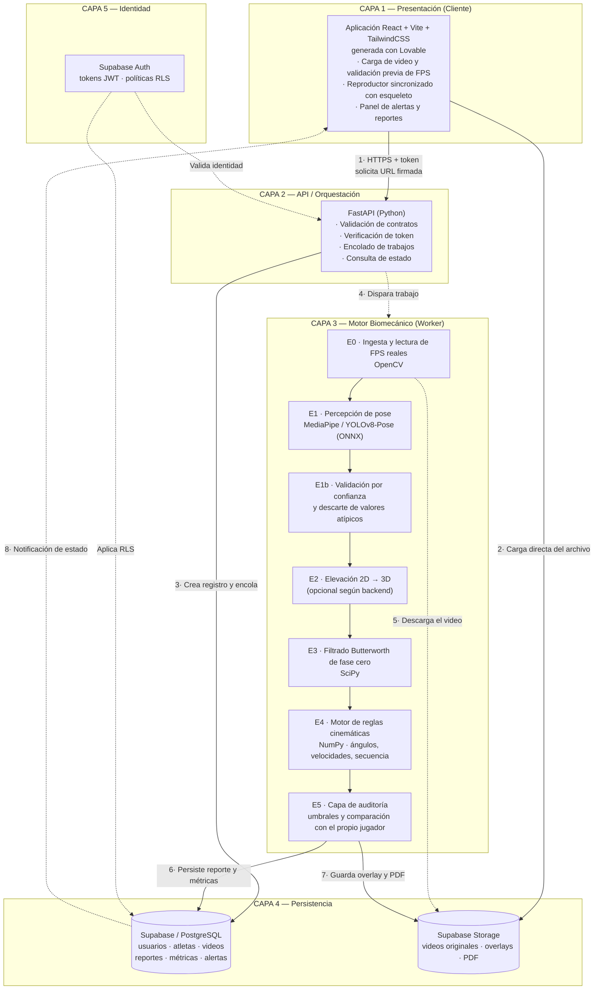
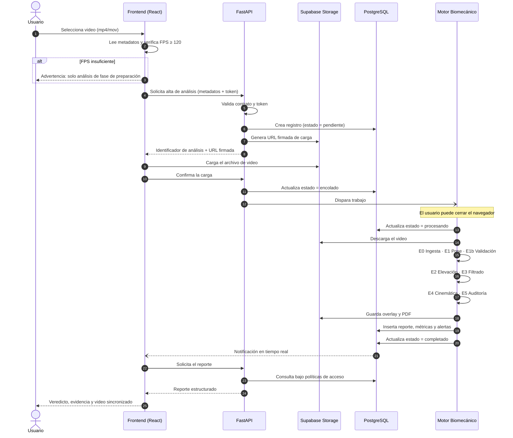
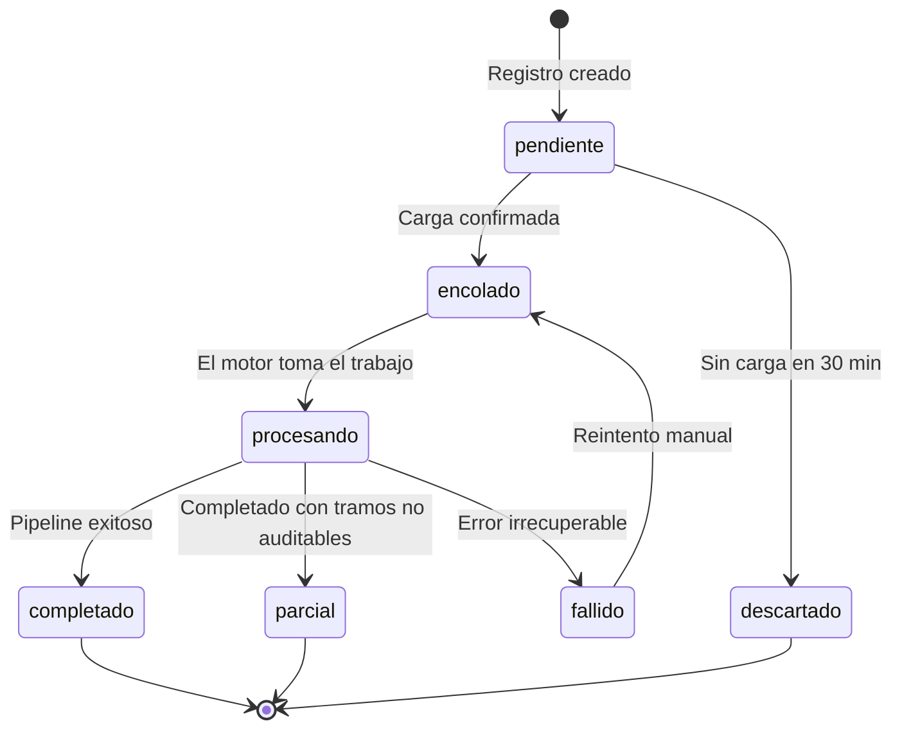
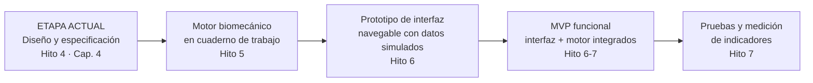
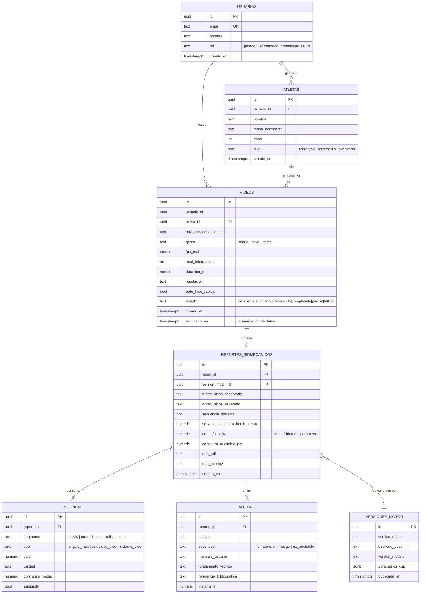
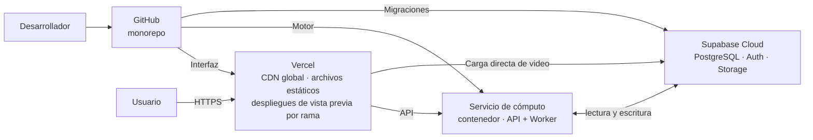
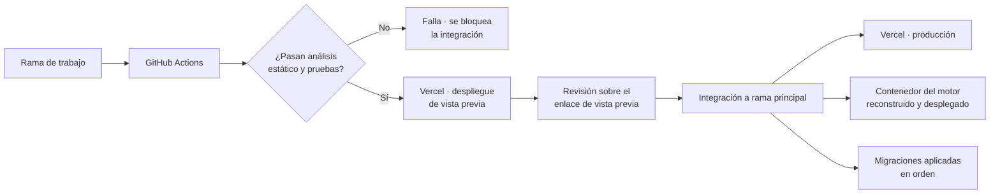

# **Capítulo 4**

# **4. Marco Tecnológico**

El Capítulo 3 cerró con tres límites que ninguna cantidad de desarrollo posterior puede eliminar: un límite físico (el teorema del muestreo, apartado 3.4.2.2), un límite lógico (la imposibilidad de predecir lesiones, apartado 3.4.1.3) y un límite legal (el régimen de Software como Producto Médico, apartado 3.4.1.5). Este capítulo asume esos límites como restricciones de diseño y a partir de ellos deriva la arquitectura, el conjunto de tecnologías, la infraestructura y los procedimientos de calidad con los que se construirá el sistema.

La tesis sostiene que el objeto medible del sistema —el orden temporal de los picos de velocidad de la cadena cinética— es estructuralmente robusto frente al peor error de la visión monocular (apartado 3.3.4.2). El presente capítulo debe demostrar que existe un conjunto de herramientas disponibles, maduras y económicamente accesibles capaz de sostener esa afirmación en un producto de software funcional. Dicho de otro modo: el Capítulo 3 estableció *qué se puede medir*; este capítulo establece *con qué se lo medirá y por qué esas herramientas y no otras*.

**Aclaración sobre el estado del proyecto.** Al momento de esta entrega, el desarrollo se encuentra en etapa de **diseño técnico y especificación**, en línea con la planificación del apartado 2.9: el Hito 4 marca el inicio del Marco Tecnológico y el comienzo de la Fase 2 del diseño, mientras que la construcción de la interfaz y del prototipo funcional corresponde al Hito 6. En consecuencia, este capítulo documenta decisiones tomadas y justificadas, no implementaciones ya realizadas. Se redacta deliberadamente en términos prospectivos allí donde corresponde, y se identifican con marcadores los lugares donde se incorporará la evidencia de desarrollo a medida que se produzca. El apartado 4.3 detalla con precisión en qué punto está el proyecto y por qué.

---

## **4.1. Factibilidad Técnica y Objetivos del Capítulo**

### **4.1.1. Objetivos del capítulo**

El Marco Tecnológico persigue cinco objetivos concretos:

1. **Demostrar la factibilidad técnica**, es decir, mostrar que cada requisito derivado de los Capítulos 1 a 3 tiene una tecnología concreta, disponible y probada que lo satisface.
2. **Justificar cada elección tecnológica** mediante criterios explícitos —madurez, costo total, curva de aprendizaje, adecuación al alcance del MVP y reversibilidad de la decisión—, dejando constancia de las alternativas evaluadas y descartadas.
3. **Definir la arquitectura del sistema** con un nivel de detalle suficiente para que un tercero pueda reimplementarla, incluyendo las responsabilidades de cada componente y el flujo de datos entre ellos.
4. **Delimitar el alcance del prototipo y del MVP**, separando lo que se construirá, lo que se simulará y lo que queda explícitamente fuera de alcance.
5. **Estimar el costo de operación** del sistema en entorno de desarrollo y en un escenario de producción de bajo volumen, aportando la base cuantitativa que el Capítulo 5 utilizará para la justificación económica.

### **4.1.2. La ventana de oportunidad tecnológica**

La afirmación central del proyecto —que un video de celular puede sustituir, para un conjunto acotado de mediciones, a un laboratorio de captura de movimiento— no habría sido defendible hace una década. Su viabilidad actual depende de la convergencia de tres desarrollos independientes que maduraron aproximadamente en la misma ventana temporal.

**Primero, la migración de la inferencia al dispositivo del usuario.** Los modelos de estimación de pose dejaron de requerir aceleradores gráficos dedicados. La combinación de arquitecturas diseñadas para eficiencia (la familia YOLO, BlazePose) con entornos de ejecución portables y optimizados (ONNX Runtime, TensorFlow Lite) permite que un modelo entrenado en un servidor se ejecute sobre el procesador de una notebook de gama media a velocidades del orden de decenas de cuadros por segundo. Esto es lo que traslada el análisis desde una instalación fija hacia el equipo del usuario, y es la condición técnica que hace posible el argumento de accesibilidad del apartado 1.3.

**Segundo, la generalización de la captura de alta frecuencia en teléfonos de consumo.** Este punto es más determinante de lo que suele reconocerse y merece detenimiento, porque es el que resuelve el límite físico identificado en el apartado 3.4.2.2. La grabación en cámara lenta a 120 y 240 cuadros por segundo dejó de ser una función de gama alta y está disponible en prácticamente todo dispositivo de gama media de los últimos años. Sin esta capacidad, el proyecto sería directamente imposible: el teorema de Nyquist-Shannon no admite negociación, y a 30 cuadros por segundo el hombro del jugador rota casi 80° entre fotograma y fotograma durante el saque. La factibilidad del sistema no descansa entonces sobre el modelo de inteligencia artificial —que es la parte visible— sino sobre una función del hardware de captura que el usuario ya posee y que el sistema deberá obligarlo a utilizar.

**Tercero, la existencia de infraestructura de nube con niveles gratuitos productivos.** Plataformas como Vercel y Supabase ofrecen niveles sin costo suficientes para operar un sistema real de bajo volumen, incluyendo base de datos relacional administrada, autenticación, almacenamiento de archivos y despliegue continuo. Esto elimina la barrera de capital inicial que, hasta hace pocos años, habría exigido contratar servidores para poner en línea un prototipo. Es un factor de factibilidad económica, pero también de factibilidad de proyecto de grado: permite que un desarrollador único sostenga la operación completa.

De la convergencia de estos tres factores surge la afirmación de factibilidad de este capítulo: **el sistema propuesto no requiere ninguna tecnología que deba ser inventada; requiere la integración cuidadosa de componentes existentes bajo un conjunto de restricciones estrictas.** El riesgo del proyecto no es tecnológico en el sentido de disponibilidad, sino de integración y de disciplina metodológica.

### **4.1.3. De los límites del Capítulo 3 a los requisitos del sistema**

Los tres límites identificados en el Marco Conceptual no son advertencias retóricas: se traducen en requisitos verificables que condicionan la arquitectura. La siguiente tabla realiza esa traducción, que constituye el puente entre el capítulo anterior y este.

| Límite (origen) | Naturaleza | Consecuencia técnica directa |
| --- | --- | --- |
| Teorema del muestreo (3.4.2.2) | Físico | El sistema debe **rechazar o degradar** todo video cuya tasa real sea inferior a 120 fps para el análisis de la fase rápida. La validación ocurre en la ingesta, no en el análisis. |
| Imposibilidad de predecir lesiones (3.4.1.3) | Lógico | El sistema **documenta y describe**, no predice. El vocabulario de la interfaz, de los reportes y de la base de datos debe reflejarlo. |
| Régimen SaMD / ANMAT (3.4.1.5) | Legal | El sistema debe **informar la atención**, no dirigirla, y debe permitir reconstruir cada conclusión desde el dato crudo. La trazabilidad deja de ser una virtud y pasa a ser un requisito de encuadre regulatorio. |
| Error sistemático de centros articulares (3.1.2.1) | Metrológico | La arquitectura debe priorizar las magnitudes inmunes al sesgo (orden de picos, separación cadera-hombro) y marcar como secundarias las que no lo son (ángulos absolutos, aceleraciones). |
| Ley 25.326 de datos personales (3.4.1.7) | Legal | Minimización del dato: el video es el insumo, no el activo. La arquitectura debe permitir descartar el video y conservar solo la telemetría numérica. |

### **4.1.4. Requisitos no funcionales derivados**

De la tabla anterior y del sondeo de demanda del apartado 3.2 se derivan los requisitos no funcionales que gobiernan las decisiones del resto del capítulo. Se los enuncia de forma verificable para que el plan de pruebas del apartado 4.7 pueda contrastarlos uno a uno.

| ID | Requisito no funcional | Forma de verificación prevista |
| --- | --- | --- |
| RNF-01 | El sistema lee la tasa de cuadros **real** del archivo y nunca la asume. Si es menor a 120 fps, el análisis de la fase de aceleración se marca como no auditable. | Prueba con archivos de 30, 60, 120 y 240 fps y con video grabado en cámara lenta. |
| RNF-02 | Todo reporte registra la versión del motor, del modelo de pose y de los parámetros de filtrado con los que fue generado. | Inspección del registro persistido. |
| RNF-03 | El filtrado es de fase cero. Ningún corrimiento temporal introducido por el filtro puede alterar el orden aparente de los picos. | Prueba con señal sintética de orden de picos conocido. |
| RNF-04 | Todo punto articular con confianza inferior al umbral se propaga marcado, y toda magnitud derivada de él se reporta como no auditable. | Prueba de propagación de la marca a lo largo del pipeline. |
| RNF-05 | El procesamiento es asincrónico: la carga y la consulta de resultados no bloquean al usuario ni dependen de una conexión sostenida. | Prueba de extremo a extremo cerrando el navegador durante el procesamiento. |
| RNF-06 | La etapa de percepción es reemplazable sin modificar el motor biomecánico (plan de repliegue del apartado 3.3.2.9). | Sustitución del backend de pose en pruebas de integración. |
| RNF-07 | Un usuario solo accede a sus propios videos y reportes; el aislamiento se aplica en la capa de datos y no solamente en la interfaz. | Pruebas de políticas de seguridad a nivel de fila. |
| RNF-08 | La salida principal para el usuario final consiste en un máximo de tres observaciones accionables; el detalle numérico está disponible pero subordinado. | Validación de usabilidad (apartado 4.6). |

---

## **4.2. Arquitectura de Software del Sistema**

### **4.2.1. Elección del estilo arquitectónico: cliente-servidor desacoplado**

El sistema adopta una **arquitectura web en capas con cliente y servidor desacoplados**, comunicados exclusivamente mediante una interfaz de programación de aplicaciones (API) sobre HTTP con intercambio de datos en formato JSON. La decisión no es una convención: responde a cuatro razones específicas del proyecto.

**Razón 1 — Incompatibilidad de ecosistemas.** El motor biomecánico es, inevitablemente, Python: las bibliotecas de estimación de pose, de procesamiento de señales y de cálculo numérico que el Capítulo 3 identificó como necesarias (OpenCV, SciPy, NumPy, ONNX Runtime, MediaPipe) constituyen un ecosistema científico sin equivalente maduro en otros lenguajes. La interfaz de usuario, por el contrario, requiere el ecosistema del navegador para la reproducción de video sincronizada con la superposición del esqueleto. Forzar ambos mundos dentro de un mismo proceso obligaría a comprometer uno de los dos.

**Razón 2 — Perfiles de escalado opuestos.** La interfaz es un conjunto de archivos estáticos: su costo marginal por usuario es prácticamente nulo y se sirve desde una red de distribución de contenido. El motor de inferencia es intensivo en procesador, se ejecuta en ráfagas de varios minutos y su costo marginal por análisis es significativo. Alojarlos juntos implicaría pagar recursos de cómputo para servir archivos estáticos, o limitar la interfaz por restricciones del motor. Separarlos permite que cada componente escale según su propia naturaleza, con consecuencias económicas directas que se cuantifican en el apartado 4.5.

**Razón 3 — Reversibilidad de la decisión de percepción.** El apartado 3.3.2.9 estableció un plan de repliegue: si la etapa de elevación tridimensional resultara demasiado lenta o insuficientemente precisa, el sistema debe poder retroceder a un análisis bidimensional con encuadre controlado sin invalidar la hipótesis. Ese repliegue solo es barato si la etapa de percepción está aislada detrás de un contrato estable. La arquitectura desacoplada, sumada a una interfaz interna de percepción dentro del motor, convierte un eventual cambio de modelo en la sustitución de un módulo y no en una reescritura.

**Razón 4 — Trazabilidad y auditoría.** El requisito RNF-02 exige que cada reporte sea reconstruible. Una arquitectura en la que el resultado numérico viaja como dato estructurado desde el motor hacia la base de datos, y la interfaz solo lo representa, hace que la evidencia quede persistida de forma independiente de su visualización. Si mañana cambia la interfaz, los reportes históricos siguen siendo auditables.

**Alternativas de arquitectura evaluadas y descartadas.**

| Alternativa | Descripción | Motivo del descarte |
| --- | --- | --- |
| Monolito Python con plantillas del lado del servidor (Django, Flask + Jinja) | Un único proceso sirve HTML e inferencia | La sincronización cuadro a cuadro entre video y esqueleto exige lógica rica en el cliente; el renderizado del lado del servidor la vuelve inviable. Además acopla el ciclo de despliegue de la interfaz al del motor. |
| Aplicación de escritorio (PyQt, Electron con Python embebido) | Todo se ejecuta en la máquina del usuario | Ventaja real en privacidad (el video nunca sale del equipo) y en costo de cómputo, pero fricción de instalación alta, distribución multiplataforma costosa y ausencia de historial compartible con el kinesiólogo, que es un caso de uso central. **Se conserva como variante futura**, no como MVP. |
| Aplicación móvil nativa | Captura y análisis en el mismo dispositivo | Duplicación de esfuerzo (iOS y Android), curva de aprendizaje incompatible con el plazo, y el análisis pesado en teléfono agrava consumo de batería y latencia. |
| Microservicios | Cada etapa del pipeline como servicio independiente | Complejidad operativa (orquestación, observabilidad distribuida, latencia entre servicios) desproporcionada para un desarrollador único y un volumen de decenas de análisis diarios. |
| Cuaderno de notas interactivo (Jupyter/Colab) | Ejecución del pipeline en un entorno de análisis | Excelente para experimentación y **efectivamente se usará en la etapa de investigación**, pero no constituye un producto entregable a un entrenador o kinesiólogo. |

### **4.2.2. Vista en capas y responsabilidades**

El sistema se organiza en cinco capas con responsabilidades estrictamente delimitadas.



**Capa 1 — Presentación.** Responsable de la interacción con el usuario y de nada más. No contendrá lógica biomecánica: no calculará ángulos, no decidirá umbrales y no interpretará resultados. Recibirá estructuras JSON ya evaluadas por el motor y las representará. Esta restricción es deliberada y responde al requisito de trazabilidad: si el cliente calculara algo, existiría una conclusión que no quedó persistida y por lo tanto no sería auditable. Sus funciones son la carga del archivo con validación previa de metadatos, la reproducción sincronizada, la representación del gráfico de secuenciación y la presentación jerarquizada de alertas.

**Capa 2 — API / Orquestación.** Actúa como frontera de confianza y como despachador. Valida que las solicitudes cumplan el contrato declarado, verifica el token de identidad, registra el trabajo en la base de datos, lo encola y responde de inmediato con un identificador. **No procesa video**: si lo hiciera, cualquier análisis excedería el tiempo máximo de una solicitud HTTP y bloquearía al servidor. Su tiempo de respuesta debe medirse en milisegundos.

**Capa 3 — Motor biomecánico.** Es el corazón del sistema y la materialización del pipeline definido en el apartado 3.3.2.7, ampliado con la etapa de auditoría. Se ejecutará como proceso trabajador independiente que consume trabajos de la cola, descarga el video, ejecuta las etapas y escribe los resultados. Es el único componente que ve el video y el único que produce conclusiones.

**Capa 4 — Persistencia.** Separa deliberadamente dos tipos de activo: la base de datos relacional guarda el dato estructurado y de bajo volumen (metadatos, métricas, alertas), mientras que el almacenamiento de objetos guarda los archivos binarios pesados (video original, video con esqueleto superpuesto, reporte en PDF). Esta separación tiene una consecuencia económica y legal relevante que se desarrolla en 4.5 y 4.7: **el sistema podrá eliminar el video original conservando íntegra la capacidad de auditar el reporte**, porque toda la evidencia numérica vive en la base relacional.

**Capa 5 — Identidad.** Emisión y verificación de credenciales, y aplicación de políticas de acceso a nivel de fila directamente en el motor de base de datos. Se detalla en 4.7.

### **4.2.3. Flujo de datos: el recorrido completo del dato**

El procesamiento asincrónico no es una preferencia de diseño sino una necesidad aritmética. Un video de saque de dos minutos grabado a 120 cuadros por segundo contiene 14.400 fotogramas. Con una velocidad de inferencia conservadora de 25 fotogramas por segundo sobre procesador, la sola etapa de percepción demanda alrededor de diez minutos. Ninguna infraestructura HTTP razonable mantiene abierta una solicitud durante ese lapso, y ningún usuario acepta una pantalla bloqueada por ese tiempo.



Dos decisiones de este flujo merecen justificación explícita. La primera es que **el archivo de video no atravesará la API**: el cliente lo cargará directamente contra el almacenamiento mediante una URL firmada de vida corta. Esto evita que el servidor de aplicación deba sostener transferencias de cientos de megabytes, reduce drásticamente su consumo de memoria y elimina un cuello de botella que, en los niveles gratuitos de las plataformas de nube, es el primer límite que se alcanza. La segunda es que **la validación de la tasa de cuadros se hará dos veces**: de forma preliminar en el cliente, para dar al usuario una advertencia inmediata antes de subir un archivo pesado, y de forma definitiva en el motor, porque la validación del cliente es una cortesía de experiencia de usuario y nunca una garantía técnica.

### **4.2.4. Estados del análisis**

La máquina de estados del análisis es el contrato entre las capas y el único mecanismo por el cual la interfaz conoce el avance del trabajo.



El estado **parcial** es una decisión de diseño derivada directamente del apartado 3.3.2.1: *un dato equivocado que se hace pasar por bueno es peor que un dato faltante*. El sistema debe poder entregar un reporte que diga con precisión qué partes del gesto pudo auditar y cuáles no, en lugar de fallar por completo o, peor, completar los huecos con estimaciones silenciosas.

### **4.2.5. Superficie de la API**

La superficie de la API se mantiene deliberadamente mínima. Cada punto de acceso adicional es una superficie de ataque y una unidad de mantenimiento; el MVP expondrá únicamente lo indispensable.

| Operación | Función | Requiere autenticación |
| --- | --- | --- |
| Alta de análisis | Crea el registro y devuelve la URL firmada de carga | Sí |
| Confirmación de carga | Confirma la subida y encola el trabajo | Sí |
| Consulta de estado | Devuelve el estado y el avance por etapa | Sí |
| Obtención del reporte | Devuelve el reporte estructurado completo | Sí |
| Listado de análisis | Lista los análisis del usuario con paginación | Sí |
| Evolución del atleta | Serie histórica para la comparación consigo mismo | Sí |
| Verificación de servicio | Disponibilidad y versión del motor | No |

El versionado explícito de la API no es un detalle cosmético: dado que los reportes persistidos deben seguir siendo interpretables aunque el motor evolucione, congelar el contrato bajo una versión declarada es parte del requisito de trazabilidad RNF-02.

> **[INSERTAR CAPTURA DE LA DOCUMENTACIÓN AUTOMÁTICA DE LA API — pendiente hasta el Hito 6]**

---

## **4.3. Prototipo, MVP y Alcance del Desarrollo**

### **4.3.1. Prototipo y MVP: dos conceptos distintos**

Corresponde diferenciar dos nociones que suelen usarse como sinónimos y que en este proyecto designan etapas distintas.

Un **prototipo** es una versión construida para validar una idea o una experiencia de uso. Puede simular funciones sin un backend real: su propósito es responder preguntas de diseño y de valor, no entregar el servicio. Un **Producto Mínimo Viable (MVP)** es, según la definición adoptada en el apartado 3.4.3.1, la versión que permite aprender lo máximo posible sobre los usuarios con el mínimo esfuerzo; es funcional, entrega valor real y puede probarse con usuarios en condiciones reales.

**En qué punto está este proyecto.** Al momento de esta entrega, el trabajo se encuentra en la **etapa de diseño técnico y especificación**, que antecede a ambas cosas. Las decisiones de arquitectura, stack, modelo de datos y experiencia de usuario están tomadas y justificadas —eso es lo que documenta este capítulo—, pero la construcción no ha comenzado. La razón es de planificación y no de retraso: el cronograma del apartado 2.9 ubica en el Hito 4 el inicio del Marco Tecnológico y de la Fase 2 del diseño (motor de procesamiento de señales), en el Hito 5 la finalización del motor de reglas cinemáticas, y en el Hito 6 la construcción de la interfaz web y de los reportes. El prototipo de interfaz y el MVP funcional son, por diseño, entregables de los hitos siguientes.

La secuencia prevista es la siguiente:



Esta secuencia responde a un criterio de reducción de riesgo: **primero se valida que el motor pueda medir lo que la tesis afirma que puede medir, y recién después se construye la interfaz que lo presenta.** Invertir el orden implicaría construir una interfaz cuidada para un motor que quizás no funcione, que es exactamente el error que el apartado 3.4.3.1 advierte al recordar que un MVP no es una versión recortada del producto sino un instrumento para despejar incertidumbre.

### **4.3.2. Qué se está probando**

De lo anterior se desprende qué debe construirse y qué no. El MVP existe para despejar cinco incertidumbres concretas; todo lo que no contribuya a ello queda fuera por definición.

| # | Incertidumbre | Tipo | Cómo la despejará el MVP |
| --- | --- | --- | --- |
| I1 | ¿Es posible ordenar de forma repetible los picos de velocidad de pelvis, torso y brazo con una sola cámara a 120–240 fps? | Técnica | Núcleo del pipeline; se medirá sobre grabaciones propias con repeticiones del mismo gesto. |
| I2 | ¿El error angular en articulaciones proximales es menor que la estimación visual humana (≈20,6°, Krosshaug et al., 2007)? | Técnica | Comparación contra medición manual sobre los mismos fotogramas. |
| I3 | ¿La comparación del jugador contra sí mismo tiene menor variabilidad que la variabilidad natural del jugador? | Metodológica | Sesiones repetidas con el mismo encuadre. |
| I4 | ¿Un entrenador o kinesiólogo encuentra un uso concreto que hoy no tiene cubierto? | De valor | Pruebas de usabilidad sobre el prototipo, con salida simplificada. |
| I5 | ¿El tiempo de procesamiento es tolerable para el usuario? | Operativa | Medición de latencia extremo a extremo. |

### **4.3.3. Alcance funcional previsto**

Se distinguen cuatro categorías: funcionalidad **de núcleo** (se construirá completa, porque de ella depende la validación de la hipótesis), **acotada** (se construirá con restricciones declaradas), **simulada** (se representará en el prototipo de interfaz con datos precargados, para validar el concepto sin construir la lógica) y **fuera de alcance**.

#### Funcionalidad de núcleo

| Módulo | Descripción | Etapa |
| --- | --- | --- |
| Registro e inicio de sesión | Alta de usuario, sesión persistente, recuperación de credenciales | Auth |
| Carga de video | Selección de archivo, validación de formato y tamaño, lectura preliminar de FPS, carga directa al almacenamiento | Frontend |
| Ingesta y metadatos | Apertura del archivo, extracción de FPS reales, resolución y duración; detección de discrepancia por cámara lenta | E0 |
| Estimación de pose | Extracción de puntos articulares con puntaje de confianza asociado | E1 |
| Validación por confianza | Marcado de puntos por debajo del umbral y propagación de la marca a las magnitudes derivadas | E1b |
| Filtrado de fase cero | Butterworth de cuarto orden aplicado bidireccionalmente sobre las series articulares | E3 |
| Ángulos articulares | Ángulo entre tres puntos: rodilla, codo, cadera | E4 |
| Separación cadera-hombro | Desfase angular entre el eje de la pelvis y el eje de los hombros | E4 |
| **Ordenamiento de picos de velocidad** | Identificación de máximos por segmento y verificación del orden proximal-distal | E4 |
| Auditoría de secuenciación | Comparación del orden observado contra el esperado y generación de alertas | E5 |
| Renderizado del esqueleto | Superposición del esqueleto y de los ángulos sobre el video original | E5 |
| Reproductor sincronizado | Video, esqueleto y curvas alineados en el mismo eje temporal | Frontend |
| Panel de alertas | Presentación jerarquizada con código de color y estado "no auditable" | Frontend |
| Historial de análisis | Listado por atleta con acceso a reportes anteriores | Frontend + BD |
| Exportación del reporte | Generación de PDF con sello de versión del motor | E5 |

El módulo destacado en negrita es el que valida la hipótesis del apartado 1.4. Si hubiera que sacrificar alcance por tiempo, todo lo demás se recorta antes que él.

#### Funcionalidad acotada

| Módulo | Restricción declarada |
| --- | --- |
| Elevación a 3D | Se implementará como etapa opcional y se evaluará comparativamente. Si no aporta mejora en las articulaciones de interés, el MVP operará en el modo de repliegue 2D con encuadre controlado (apartado 3.3.2.9). |
| Segmentación de golpes | La detección automática del instante de impacto es frágil (apartado 3.4.2.5: el impacto ocupa todas las frecuencias). El MVP admitirá **marcado manual asistido** del intervalo del golpe, con detección automática como sugerencia revisable. |
| Cobertura de gestos | Saque implementado en profundidad por ser el gesto con mayor respaldo bibliográfico (Kovacs y Ellenbecker, 2011; Fleisig et al., 2003). Drive y revés con un conjunto reducido de reglas. |
| Rotación interna de hombro | No calculable con 17 puntos (apartado 3.3.3.4). Se reportará un indicador indirecto y se declarará la limitación en el propio reporte. |
| Comparación contra referencia | Contra una única secuencia de referencia cargada manualmente, no contra una base de patrones. |

#### Funcionalidad simulada en el prototipo

| Módulo | Qué se simulará | Por qué |
| --- | --- | --- |
| Auditoría de fatiga intra-sesión | Comparación entre el primer y el último bloque de golpes, con datos precargados | Requiere un volumen de sesiones reales que excede el plazo; el concepto se valida en la interfaz. |
| Panel del profesional de la salud | Vista de kinesiólogo con múltiples atletas, poblada con datos de prueba | Valida el flujo de trabajo clínico sin requerir usuarios reales con historia clínica. |
| Notificaciones por correo | Envío simulado | Servicio externo que no aporta a ninguna de las cinco incertidumbres. |
| Umbrales normativos poblacionales | Valores importados de literatura de élite, con advertencia explícita de extrapolación (Brecha 7) | No existen umbrales validados para población amateur argentina. |

#### Fuera de alcance

Análisis en tiempo real durante el entrenamiento; procesamiento de partidos completos con múltiples jugadores; voleas, dejadas y golpes de aproximación; integración con sensores externos o plataformas de fuerza; aplicación móvil nativa; facturación y suscripciones; certificación ante ANMAT; validación clínica longitudinal.

### **4.3.4. Criterios de éxito y plan de pruebas del prototipo**

Se retoman los criterios enunciados en el apartado 3.4.3.2, agregando la forma concreta de medición prevista. Estos criterios constituyen, además, el vínculo con el Capítulo 7 de presentación de resultados.

| # | Criterio | Meta | Instrumento de medición | Acción si no se cumple |
| --- | --- | --- | --- | --- |
| 1 | Ordenamiento de picos en la fase de aceleración | Pelvis, torso y brazo distinguibles y ordenables de forma repetible en al menos 8 de cada 10 repeticiones válidas | Repeticiones del mismo gesto; matriz de concordancia del orden | Replegarse a la fase de preparación |
| 2 | Error angular en articulaciones proximales | Inferior a 20,6° (referencia de estimación visual humana) | Comparación contra goniometría manual sobre fotogramas seleccionados | Replegarse a 2D con encuadre controlado |
| 3 | Repetibilidad de la comparación consigo mismo | Variabilidad del sistema menor que la variabilidad intra-sujeto | Sesiones repetidas; análisis de dispersión | Descartar la comparación consigo mismo como base clínica |
| 4 | Latencia de procesamiento | Definida por lo que declaren los usuarios en la validación de usabilidad | Medición extremo a extremo | Reducir alcance o diferir el procesamiento |
| 5 | Utilidad percibida | Los usuarios señalan un uso concreto hoy no cubierto | Entrevistas guiadas posteriores a la prueba | Cambiar el producto, no la tecnología |

> **[INSERTAR RESULTADOS DE LA MEDICIÓN DE CADA CRITERIO — pendiente hasta el Hito 7]**

### **4.3.5. Organización prevista del repositorio**

El proyecto se organizará como **monorepo**: un único repositorio de control de versiones que contendrá la interfaz, el motor y la definición de infraestructura. Para un desarrollador único, la separación en múltiples repositorios impone un costo de coordinación —versionado cruzado, sincronización de contratos, duplicación de configuración de integración continua— que no se compensa con ningún beneficio a esta escala.

```
sistema-biomecanico-tenis/
│
├── README.md
├── .github/workflows/          # Integración continua (frontend y backend)
│
├── frontend/                   # Generado y mantenido con Lovable
│   └── src/
│       ├── lib/                # Cliente de API, sesión, verificación de FPS
│       ├── components/         # Reproductor sincronizado, gráfico de
│       │                       # secuenciación, tarjetas de alerta
│       ├── pages/              # Login, panel, carga, reporte, historial
│       └── types/              # Espejo del contrato de datos del backend
│
├── backend/
│   ├── Dockerfile
│   └── app/
│       ├── main.py             # Instancia de la API y rutas
│       ├── security.py         # Verificación de token
│       ├── schemas/            # Contratos de entrada y salida
│       ├── routers/            # Puntos de acceso
│       ├── workers/            # Orquestación de las etapas E0–E5
│       └── engine/             # NÚCLEO BIOMECÁNICO — sin dependencias web
│           ├── version.py      # Sello de trazabilidad
│           ├── ingest.py       # E0 · lectura de FPS reales
│           ├── pose/           # E1 · contrato + backends intercambiables
│           ├── validation.py   # E1b · confianza y valores atípicos
│           ├── lifting.py      # E2 · elevación 2D → 3D
│           ├── dsp.py          # E3 · filtrado de fase cero
│           ├── kinematics.py   # E4 · ángulos y velocidades
│           ├── sequencing.py   # E4 · orden de la cadena cinética
│           ├── audit.py        # E5 · umbrales y alertas
│           └── render.py       # E5 · superposición del esqueleto
│
├── supabase/
│   ├── migrations/             # Esquema versionado en SQL
│   └── policies/               # Políticas de seguridad a nivel de fila
│
├── tests/
│   ├── unit/                   # Motor, con señales sintéticas
│   ├── integration/            # Pipeline completo
│   └── fixtures/videos/        # Videos de referencia para regresión
│
└── docs/
    ├── arquitectura.md
    ├── decisiones/             # Registro de decisiones de arquitectura
    └── protocolo_grabacion.md  # Instructivo de captura para el usuario
```

Una decisión estructural merece énfasis: **el directorio del motor no importará ninguna biblioteca web**. No conocerá la API, no conocerá la base de datos y no conocerá HTTP. Recibirá rutas de archivo y devolverá estructuras de datos. Esta disciplina tiene tres consecuencias prácticas: permite ejecutar y depurar todo el motor desde un cuaderno de trabajo durante la investigación —que es exactamente lo que ocurrirá en el Hito 5, antes de que exista interfaz alguna—, permite probarlo sin levantar servidor, y permite empaquetarlo como aplicación de escritorio si el plan de repliegue lo exigiera. Es la materialización concreta del requisito RNF-06.

> **[INSERTAR ENLACE AL REPOSITORIO DE GITHUB]**
>
> **[INSERTAR CAPTURA DEL ÁRBOL DE DIRECTORIOS Y DEL HISTORIAL DE COMMITS — pendiente]**

### **4.3.6. Limitaciones actuales y próximos pasos**

**Limitaciones al momento de esta entrega.** No existe código productivo; las estimaciones de tiempo de procesamiento del apartado 4.5 son proyecciones basadas en la literatura y no en mediciones propias; la elección del backend de percepción está justificada pero no verificada empíricamente sobre gestos de tenis; y los umbrales del motor de reglas siguen siendo importados de población de élite, con la limitación ya declarada en la Brecha 7.

**Próximos pasos inmediatos.** Montaje del entorno de desarrollo y verificación de que las bibliotecas seleccionadas se instalan y ejecutan sobre el hardware disponible; grabación de un primer conjunto de videos propios a 120 y 240 fps siguiendo el protocolo de captura; implementación del pipeline E0 a E4 en cuaderno de trabajo sobre esos videos; y medición preliminar del criterio 1 del apartado 4.3.4, que es el que decide si el proyecto continúa por la vía prevista o activa el plan de repliegue.

---

## **4.4. Stack de Software y Justificación de Tecnologías**

Se documenta cada tecnología según cuatro ejes exigidos: **nombre y versión**, **capa en la que se usa**, **justificación de la elección** y **alternativas evaluadas y descartadas**. Se sigue un criterio de decisión uniforme, enunciado aquí para evitar repetirlo: **ante dos herramientas de capacidad comparable, se elige la de menor curva de aprendizaje y mayor madurez documental**, porque el recurso más escaso del proyecto no es el cómputo sino el tiempo de un desarrollador único que además debe redactar una tesis. Este criterio es coherente con la advertencia del apartado 1.6 sobre el perfil de recursos humanos disponible.

### **4.4.1. Interfaz de usuario: React + Vite + TailwindCSS, generada con Lovable**

**Versiones previstas:** React 18.3 · Vite 5.x · TypeScript 5.x · TailwindCSS 3.4 · **Capa:** presentación.

**Función.** Carga de archivos, reproducción sincronizada de video con superposición del esqueleto, gráficos de secuenciación y evolución, y panel de alertas.

**Justificación.** React es el estándar de facto para interfaces con estado complejo, y este proyecto lo tiene: el reproductor debe mantener sincronizados el fotograma actual del video, la posición sobre la curva biomecánica y el estado de la línea de tiempo de alertas, todo respondiendo al mismo reloj. Un modelo declarativo basado en estado resuelve esa sincronización de forma natural, mientras que la manipulación directa del árbol de documento la convierte en una fuente permanente de errores. Vite aporta un ciclo de recarga inmediata que reduce el tiempo de iteración visual, y produce una compilación de archivos estáticos que se sirve a costo prácticamente nulo desde una red de distribución de contenido —premisa del análisis económico del apartado 4.5. TailwindCSS evita la deriva de hojas de estilo propias, que en un proyecto con un único desarrollador tiende a volverse inconsistente, y facilita implementar el sistema de color semántico del apartado 4.6 mediante una paleta declarada una sola vez.

**Sobre el uso de Lovable.** Lovable es una plataforma de generación asistida que produce un proyecto React + Vite + TailwindCSS convencional a partir de descripciones en lenguaje natural. Su adopción se justifica por una razón alineada con la naturaleza del proyecto: **la interfaz es un medio, no el objeto de investigación**. La contribución original de la tesis reside en el motor biomecánico y en la validación de la hipótesis del apartado 1.4; invertir semanas en escribir componentes de formulario desplazaría tiempo desde donde está el aporte hacia donde no lo está. Esto es coherente con el apartado 1.6, que ya contempla el uso de asistentes de inteligencia artificial generativa como facilitadores del desarrollo. Dos salvaguardas acompañan la decisión: el código generado se versionará en el repositorio propio y se revisará como cualquier otro código —no se lo tratará como caja negra—, y no se delegará a la herramienta ninguna lógica de cálculo biomecánico, que residirá íntegramente en el backend por las razones de trazabilidad ya expuestas.

**Alternativas descartadas.**

| Alternativa | Motivo del descarte |
| --- | --- |
| Streamlit / Gradio | Muy atractivas por su velocidad de prototipado en Python, pero el reproductor sincronizado con superposición de esqueleto y línea de tiempo interactiva excede lo que sus componentes permiten. Además producen una estética de herramienta interna, incompatible con la validación de usabilidad con entrenadores y kinesiólogos. |
| Next.js | Aporta renderizado del lado del servidor y rutas de API, ninguno de los cuales aprovecha una aplicación privada tras inicio de sesión. Agrega complejidad conceptual sin beneficio para este caso. |
| HTML, CSS y JavaScript sin framework | Viable en volumen, pero la sincronización de estado se vuelve manual y frágil; el ahorro inicial se paga con creces en depuración. |
| Vue o Svelte | Técnicamente adecuados; se descartan por menor disponibilidad de ejemplos, componentes y soporte de herramientas asistidas frente a React. |

### **4.4.2. Servidor de aplicación: FastAPI + Python**

**Versiones previstas:** Python 3.11 · FastAPI 0.11x · Uvicorn 0.3x · Pydantic 2.x · **Capa:** API y orquestación.

**Función.** Exponer la API, validar contratos de entrada y salida, verificar identidad, orquestar el encolado de trabajos y servir los reportes persistidos.

**Justificación.** La elección de Python para el servidor no es realmente una elección: el motor biomecánico debe ser Python porque allí viven las bibliotecas científicas. La única decisión real es qué framework usar dentro de Python. FastAPI se elige por cuatro motivos. Primero, la validación automática de esquemas convierte el contrato de datos en código ejecutable: si el motor devuelve una estructura que no cumple el esquema declarado, el error aparece en el servidor y no en el navegador del usuario, lo cual es especialmente valioso en un sistema donde el dato transporta conclusiones sobre salud. Segundo, genera documentación interactiva de la API de forma automática, lo que sirve tanto para el desarrollo como para la evidencia documental de esta tesis. Tercero, su soporte nativo de programación asincrónica permite que el servidor responda solicitudes mientras hay trabajos en curso. Cuarto, dispone de un mecanismo de tareas en segundo plano que permite implementar el encolado del MVP sin introducir infraestructura adicional.

**Sobre la cola de trabajos: aplicación del criterio de MVP.** Existe una tentación clara de incorporar desde el inicio un sistema de colas robusto como Celery con Redis. Se descarta para el MVP. Con un volumen de análisis medido en unidades por día, el mecanismo de tareas en segundo plano de FastAPI combinado con el campo de estado en la base de datos cumple la misma función con una fracción de la complejidad operativa: no requiere un servicio adicional, no agrega costo de infraestructura y no introduce un nuevo componente que pueda fallar. La limitación conocida es que un reinicio del proceso pierde los trabajos en curso; se mitigará con un mecanismo que, al arrancar, vuelva a encolar los análisis que quedaron en estado *procesando*. **La migración a una cola persistente queda documentada como decisión diferida, con su criterio de activación explícito: más de veinte análisis concurrentes o más de un proceso trabajador.** Registrar la decisión diferida junto con su disparador es en sí mismo una práctica de ingeniería: evita tanto la complejidad prematura como la deuda técnica silenciosa.

**Alternativas descartadas.**

| Alternativa | Motivo del descarte |
| --- | --- |
| Flask | Maduro y simple, pero sin validación de esquemas ni documentación automática integradas; requiere extensiones que reconstruyen manualmente lo que FastAPI ofrece de base. |
| Django + Django REST Framework | Muy completo, pero su modelo de trabajo impone una estructura pesada para una API de siete operaciones, y su capa de acceso a datos entra en conflicto con el uso de Supabase. |
| Node.js + Express | Obligaría a comunicarse con el motor Python mediante subprocesos o un servicio adicional, agregando una frontera de proceso sin beneficio compensatorio. |

### **4.4.3. Percepción visual: revisión y corrección del stack propuesto**

Este apartado contiene la **corrección técnica más importante del capítulo** respecto del stack originalmente previsto, y su origen está en un hallazgo ya documentado en el apartado 3.1.4.

**El problema.** El stack inicial enunciaba "YOLOv8-Pose para la estimación de postura 3D". Esa descripción es técnicamente incorrecta. La documentación oficial de Ultralytics establece que los modelos de pose de la familia YOLOv8 se entrenan sobre COCO-Pose y producen 17 puntos articulares expresados como tripletas de coordenada horizontal, coordenada vertical y visibilidad. **No existe un eje de profundidad.** YOLOv8-Pose es un detector bidimensional. Sostener lo contrario en una tesis de ingeniería sería un error verificable en la documentación del propio fabricante, y el Capítulo 3 ya lo anticipó al exigir que el Objetivo Específico 1 se reformulara como arquitectura de dos etapas.

**Las dos vías técnicamente válidas.** A partir del apartado 3.3.2.2, existen dos caminos coherentes con el alcance del proyecto:

- **Vía A — Dos etapas:** YOLOv8-Pose sobre ONNX Runtime como percepción bidimensional, seguida de un modelo de elevación temporal (VideoPose3D, MotionAGFormer, MotionBERT) que reconstruye la profundidad aprovechando la secuencia de fotogramas.
- **Vía B — Una etapa:** MediaPipe Pose, que entrega directamente 33 puntos con coordenada de profundidad estimada, en una única dependencia.

| Criterio | Vía A: YOLOv8-Pose + elevación | Vía B: MediaPipe Pose |
| --- | --- | --- |
| Puntos articulares | 17 (COCO) | 33 (incluye manos y pies) |
| Salida | 2D nativa; 3D tras la segunda etapa | 3D directa |
| Componentes a integrar | Dos modelos, dos formatos, dos etapas de depuración | Uno |
| Rotación de hombro (limitación 3.3.3.4) | No abordable: COCO carece de puntos en la mano | Parcialmente abordable: incluye puntos de la mano que permiten un indicador indirecto |
| Precisión reportada (Rode et al., 2025) | Depende del par elegido; la elevación mejora las articulaciones fuera del plano | Mejor de los modelos 3D directos evaluados: 146 mm de error, 17,2° en rodilla, detección en 98,8 % de los cuadros |
| Sesgo de entrenamiento | COCO: escenas cotidianas generales | Yoga y gimnasia, disciplinas distintas del tenis |
| Portabilidad de despliegue | Excelente vía ONNX | Buena, con dependencia del ecosistema del proveedor |
| Tiempo estimado de integración | Alto | Bajo |
| Reversibilidad | Alta (etapas independientes) | Media |

**Decisión adoptada.** Se definirá una **interfaz interna de percepción** —un contrato de programación que declara qué debe entregar cualquier estimador de pose para ser utilizable por el motor: puntos articulares por fotograma, puntajes de confianza y correspondencia con un mapa de articulaciones canónico. Sobre ese contrato se implementarán ambas vías. El MVP se construirá con **MediaPipe Pose como opción por defecto**, por tres razones: entrega tridimensionalidad de extremo a extremo con una sola dependencia, lo que acelera decisivamente la llegada al primer resultado medible; sus 33 puntos incluyen la mano, lo que mitiga parcialmente una limitación que el Capítulo 3 declaró de fondo; y en la evaluación independiente más reciente disponible resultó el mejor de su categoría. **La Vía A se implementará en paralelo como alternativa** y se evaluará contra la misma batería de pruebas, quedando disponible tanto como camino de mayor precisión como en calidad de plan de repliegue.

Esta decisión no contradice al Capítulo 3, que ya dejaba abierta explícitamente la alternativa MediaPipe; lo que hace es resolver la apertura con un criterio de MVP —maximizar aprendizaje por unidad de esfuerzo— y con una salvaguarda de reversibilidad. El Objetivo Específico 1 debe, en consecuencia, redactarse de forma neutral respecto del modelo: *diseñar e implementar una arquitectura de estimación de pose intercambiable, capaz de operar sobre video monocular estándar, con opciones bidimensional-con-elevación y tridimensional-directa, y con repliegue a análisis bidimensional sobre plano controlado*.

**Versiones previstas:** MediaPipe 0.10.x · Ultralytics 8.x · ONNX Runtime 1.18.x · **Capa:** motor biomecánico (E1–E2).

**Alternativas descartadas.**

| Alternativa | Motivo del descarte |
| --- | --- |
| OpenPose | Referencia histórica y el más usado en la literatura (14 de 50 estudios según Aulton et al., 2025), pero pesado, con licencia restrictiva para uso comercial y con requisitos de compilación que complican el despliegue. |
| HRNet / RTMPose | RTMPose fue el modelo 2D más preciso en Rode et al. (2025), con 9,3° de error en flexión de rodilla y detección en el 100 % de los cuadros. Se descarta como opción inicial por el costo de integración de su ecosistema, pero **se registra como el candidato principal de mejora** una vez validado el pipeline completo. |
| OpenCV puro con métodos clásicos | Detección por bordes, sustracción de fondo o descriptores manuales. Descartado por la razón desarrollada en el apartado 3.3.1.2: las posturas deportivas son demasiado variadas para reglas escritas a mano. |
| OpenCap / Pose2Sim | Soluciones validadas de grado investigación, pero ambas requieren múltiples cámaras calibradas —exactamente la barrera que el proyecto busca eliminar (Brecha 6). |

### **4.4.4. Manipulación de video: OpenCV**

**Versión prevista:** OpenCV-Python 4.10.x · **Capa:** motor biomecánico (E0 y E5).

**Función.** Apertura del contenedor de video, extracción de metadatos, iteración fotograma a fotograma, transformaciones de tamaño y espacio de color, y renderizado de la superposición del esqueleto sobre el video de salida.

**Justificación.** OpenCV es el estándar indiscutido del procesamiento de imágenes y ya fue adoptado como tal en el apartado 2.2.1. Su rol más crítico en este sistema no es el más visible: es la **lectura de la tasa real de cuadros**, que el apartado 3.3.1.1 identificó como el dato del que depende la validez de toda medición temporal. El sistema deberá leer el valor efectivo del archivo, contrastarlo contra la duración real y detectar el caso de la grabación en cámara lenta, donde el contenedor puede declarar una tasa de reproducción distinta de la tasa de captura. Un error aquí no genera ruido: genera un reporte internamente coherente y completamente falso. La constante que define el mínimo de 120 fps será, probablemente, el parámetro más cargado de fundamento teórico de todo el sistema, ya que sintetiza el análisis de Nyquist sobre las velocidades angulares de Fleisig et al. (2003) y define la frontera entre un análisis válido y uno que solo aparenta serlo.

**Alternativas descartadas.** FFmpeg invocado directamente resulta más eficiente para la extracción masiva de fotogramas, pero exige gestionar un proceso externo y no ofrece las primitivas de dibujo necesarias para el renderizado del esqueleto; se contempla su uso complementario únicamente si la lectura de video se convirtiera en cuello de botella. PyAV y decord aportan ventajas de rendimiento pero con comunidades sensiblemente menores.

### **4.4.5. Procesamiento matemático: NumPy y SciPy**

**Versiones previstas:** NumPy 1.26.x · SciPy 1.13.x · **Capa:** motor biomecánico (E3 y E4).

**Función.** NumPy provee la representación de las series articulares como arreglos multidimensionales y las operaciones vectoriales de las que se derivan los ángulos. SciPy provee el diseño y la aplicación del filtro Butterworth y la detección de máximos locales.

**Justificación.** Ambas bibliotecas son la base sobre la que se construye prácticamente todo el ecosistema científico de Python; su elección no requiere defensa comparativa. Lo que sí la requiere es **cómo se las usará**, porque en tres puntos concretos la diferencia entre un uso correcto y uno incorrecto separa un análisis válido de uno inválido.

**Punto crítico 1 — Fase cero.** El apartado 3.4.2.3 estableció que un filtro aplicado en un solo sentido introduce un corrimiento temporal, y que como distintos segmentos corporales tienen distinto contenido frecuencial, ese corrimiento sería distinto para cada uno, alterando el orden aparente de los picos —precisamente la magnitud que el sistema mide. SciPy ofrece dos funciones de aplicación de filtros: una unidireccional y una bidireccional. Solo la segunda es admisible en este proyecto. La diferencia es de una palabra en el código y de validez completa en el resultado, y por eso se convertirá en una prueba automatizada (apartado 4.7.2) y no en una recomendación de estilo.

**Punto crítico 2 — Elección objetiva del punto de corte.** El apartado 3.4.2.4 descartó la elección arbitraria del corte y adoptó el análisis residual de Winter: se filtra la señal con distintos cortes, se mide cuánto se aleja el resultado del original en cada caso, y se identifica el punto donde el filtro deja de remover ruido y comienza a remover movimiento real. Este procedimiento se implementará como función del motor y su resultado se persistirá junto al reporte, de modo que un tercero pueda verificar con qué corte se produjo cada análisis. Es un ejemplo concreto de cómo el requisito de trazabilidad RNF-02 desciende hasta el nivel del parámetro individual.

**Punto crítico 3 — Cálculo del ángulo entre tres puntos.** El ángulo articular se obtiene formando dos vectores a partir de tres puntos —por ejemplo cadera, rodilla y tobillo— y calculando el ángulo entre ellos mediante el producto escalar. Es el cálculo número 2 de la tabla del apartado 3.3.4.2, clasificado como de confiabilidad media-alta precisamente porque al restar coordenadas cancela buena parte del desvío fijo: si los tres puntos están corridos en la misma dirección, el corrimiento se cancela y el ángulo se conserva.

**Alternativas descartadas.** MATLAB, empleado por antecedentes como el paquete BiomSoft de la Universidad de Extremadura (apartado 3.1.1), se descarta por licenciamiento propietario incompatible con el objetivo de accesibilidad y por la imposibilidad de desplegarlo en un servicio web de bajo costo. Pandas se reserva para el análisis exploratorio y la exportación tabular, pero no para el pipeline de señales, donde la sobrecarga de un marco de datos etiquetado no aporta frente a arreglos numéricos puros.

### **4.4.6. Base de datos y modelo de datos: Supabase (PostgreSQL)**

**Versión prevista:** PostgreSQL 15 administrado por Supabase · **Capa:** persistencia, identidad y almacenamiento.

**Función.** Supabase agrupa cuatro servicios que el sistema necesita: base de datos relacional, autenticación, almacenamiento de objetos y notificaciones en tiempo real.

#### Relacional frente a no relacional

El criterio determinante es la **naturaleza relacional del dominio**. Los datos del sistema son intrínsecamente relacionales: un usuario tiene atletas, un atleta tiene videos, un video produce un reporte, un reporte contiene métricas y alertas. Las consultas que el producto necesita —la evolución de la separación cadera-hombro de un atleta a lo largo de sus últimas diez sesiones, base de la comparación consigo mismo del apartado 3.3.4.5— son agregaciones sobre relaciones, exactamente aquello para lo que existe el modelo relacional y aquello que una base documental resuelve mal. A esto se suma que el esquema de este dominio es estable y conocido: la flexibilidad de esquema que ofrecen las bases no relacionales no representa una ventaja aquí, y su rigidez es en cambio un activo para la auditabilidad.

El segundo criterio es la **seguridad a nivel de fila**. Al tratarse de información sobre el cuerpo de personas identificables —dato sensible bajo la Ley 25.326 según el apartado 3.4.1.7—, el aislamiento entre usuarios no puede depender de que la aplicación filtre correctamente cada consulta. PostgreSQL permite declarar políticas que el propio motor de base de datos aplica: aunque una consulta mal escrita solicite todas las filas, la base devuelve únicamente las que corresponden al solicitante. Se pasa de una garantía por convención a una garantía estructural.

El tercer criterio es la **consolidación de servicios**: autenticación, almacenamiento y base de datos bajo un mismo proveedor con un mismo modelo de identidad elimina la integración manual entre sistemas, que es donde suelen originarse las vulnerabilidades en proyectos pequeños.

**Alternativas descartadas.**

| Alternativa | Motivo del descarte |
| --- | --- |
| Firebase / Firestore | Modelo documental sin uniones nativas; las consultas de evolución histórica exigirían desnormalización manual y consultas múltiples. Dependencia de un único proveedor sin ruta clara de migración. |
| MySQL | Adecuado, pero PostgreSQL ofrece mejor soporte de tipos estructurados y de políticas a nivel de fila, y es el motor sobre el que se apoya Supabase. |
| PostgreSQL autogestionado en una máquina virtual | Control total, pero traslada al proyecto la responsabilidad de respaldos, actualizaciones de seguridad y disponibilidad; costo operativo desproporcionado. |
| MongoDB | Flexibilidad de esquema innecesaria y débil soporte de integridad referencial, que aquí es un requisito. |
| SQLite | Adecuado para un prototipo local, pero sin concurrencia ni acceso remoto; incompatible con el caso de uso de compartir el reporte con el kinesiólogo. |

#### Modelo de datos: entidades y relaciones



Las relaciones son de uno a muchos en todos los casos, salvo la que vincula un video con su reporte, que es de uno a uno opcional (un video puede no haber sido procesado todavía o haber fallado). Tres decisiones de modelado merecen comentario.

**La tabla de versiones del motor y su relación con los reportes** es la materialización directa del requisito RNF-02 y de la exigencia de seguimiento posterior a la puesta en producción del apartado 3.4.1.7. Un reporte que no declara con qué versión del motor fue generado no es auditable, y por lo tanto no cumple el criterio que mantiene al sistema fuera de la categoría de producto médico de mayor riesgo. Al modelarlo como relación y no como texto libre, se garantiza que cada reporte histórico siga siendo interpretable aunque el motor haya cambiado varias veces.

**El campo de auditabilidad en las métricas** propaga hasta la unidad mínima de dato la decisión conceptual del apartado 3.3.2.1. Una métrica derivada de puntos con confianza insuficiente no se omite ni se estima: se persiste con su marca, para que tanto la interfaz como un auditor externo puedan distinguir "el sistema midió esto" de "el sistema no pudo medir esto".

**Los campos de fundamento técnico y referencia bibliográfica en las alertas** implementan la Brecha 2 identificada en el apartado 3.1.4. Cada alerta que el sistema emita debe poder responder dos preguntas: qué magnitud concreta la disparó y qué fuente respalda el criterio. Es la diferencia operativa entre este proyecto y los productos comerciales cerrados analizados en el apartado 3.1.3.

#### Integridad, migraciones y respaldos

**Integridad.** Se apoyará en los mecanismos propios del motor relacional y no en validaciones de la aplicación: claves foráneas con borrado en cascada donde corresponde, restricciones de unicidad sobre el correo del usuario, restricciones de verificación sobre los campos de dominio acotado (estado del análisis, severidad de la alerta, rol del usuario) y campos obligatorios declarados como no nulos. El principio es que **un dato inconsistente no debe poder escribirse**, en lugar de detectarse más tarde.

**Migraciones.** El esquema se versionará como archivos SQL numerados dentro del propio repositorio, bajo el directorio de migraciones. Cada cambio de esquema será un archivo nuevo, nunca la edición de uno anterior. Esto permite que el esquema evolucione de forma reproducible: cualquier entorno —desarrollo, prueba o producción— llega al mismo estado aplicando la misma secuencia. La aplicación de migraciones se integrará al flujo de despliegue descripto en 4.7.3, de modo que el esquema y el código avancen juntos y nunca queden desfasados.

**Respaldos.** Se apoyarán en los respaldos automáticos diarios que ofrece la plataforma en su nivel pago, complementados por una exportación manual periódica del esquema y de los datos antes de cada cambio estructural relevante. Dado que el activo crítico del sistema es el dato numérico y no el video —consecuencia de la política de retención del apartado 4.5.2—, el volumen a respaldar es pequeño y la operación resulta económicamente trivial. Se documentará además el procedimiento de restauración, dado que un respaldo cuya restauración nunca se probó no constituye una garantía real.

> **[INSERTAR CAPTURA DEL EDITOR DE TABLAS DE SUPABASE CON EL ESQUEMA IMPLEMENTADO — pendiente]**

### **4.4.7. Síntesis del stack**

| Capa | Tecnología | Versión prevista | Rol |
| --- | --- | --- | --- |
| Presentación | React + Vite + TypeScript + TailwindCSS (Lovable) | 18.3 / 5.x / 5.x / 3.4 | Interfaz y sincronización visual |
| API | FastAPI + Uvicorn + Pydantic | 0.11x / 0.3x / 2.x | Contratos, identidad, orquestación |
| Percepción | MediaPipe Pose (por defecto) / YOLOv8-Pose + ONNX Runtime (alternativa) | 0.10.x / 8.x / 1.18.x | Extracción de puntos articulares |
| Video | OpenCV-Python | 4.10.x | Ingesta, metadatos, renderizado |
| Cálculo | NumPy + SciPy | 1.26.x / 1.13.x | Filtrado, ángulos, picos |
| Datos | Supabase (PostgreSQL) | 15 | Persistencia relacional y políticas |
| Identidad | Supabase Auth | — | Tokens y seguridad a nivel de fila |
| Archivos | Supabase Storage | — | Video, overlay y PDF |
| Reportes | ReportLab o WeasyPrint | 4.x / 62.x | Exportación en PDF |
| Versionado | Git + GitHub | — | Control de versiones e integración continua |

---

## **4.5. Infraestructura, Hosting y Estimación de Costos**

### **4.5.1. Topología de despliegue**

La infraestructura se organiza en tres componentes con perfiles de costo deliberadamente distintos, siguiendo el principio establecido en 4.2.1 de que cada elemento debe escalar según su naturaleza. Se trata de una solución íntegramente en la nube: no se contempla infraestructura propia, dado que un servidor local implicaría costos de energía, mantenimiento y disponibilidad que ninguna ventaja compensa a esta escala.



**Interfaz en Vercel.** La compilación produce archivos estáticos distribuidos desde una red global de entrega de contenido. No hay servidor que mantener, el costo marginal por visita es despreciable y cada rama del repositorio genera automáticamente un despliegue de vista previa con dirección propia, lo cual resulta especialmente útil para las pruebas de usabilidad del apartado 4.6: permite enviar a un entrenador un enlace a una versión específica sin afectar el entorno principal.

**Datos y archivos en Supabase Cloud.** Base de datos administrada con respaldos automáticos, autenticación y almacenamiento de objetos. Elimina la carga operativa de administrar una base de datos, que para un proyecto de un solo desarrollador representa un riesgo real de pérdida de información.

**Cómputo del motor: la decisión abierta.** Es el único componente cuya ubicación no resulta evidente, porque combina requisitos poco frecuentes: ráfagas de varios minutos de uso intensivo de procesador, dependencias pesadas —OpenCV y los modelos de pose superan holgadamente el gigabyte— y demanda intermitente.

| Opción | Ventajas | Desventajas | Veredicto |
| --- | --- | --- | --- |
| **Procesamiento local** (equipo propio o del club) | Costo cero; el video nunca sale del equipo, lo que simplifica el encuadre bajo la Ley 25.326 | Requiere que el equipo esté encendido; sin disponibilidad continua | **Desarrollo, investigación y demostración** |
| Funciones serverless (Vercel, AWS Lambda) | Escalado automático, pago por uso | Límites de tiempo de ejecución y de tamaño de paquete incompatibles con las dependencias del motor | Descartada |
| **Contenedor persistente** (Render, Railway, Fly.io) | Sin límite de tiempo de ejecución; despliegue por contenedor; costo predecible y bajo | Costo fijo aunque no haya uso | **Producción del MVP** |
| Cómputo especializado con GPU (Modal, RunPod) | Reduce fuertemente el tiempo de inferencia; facturación por segundo de uso | Costo desproporcionado para el volumen previsto; contradice la premisa de operar sobre hardware accesible | **Diferida**, a reevaluar si el criterio 4 del apartado 4.3.4 no se cumple |
| Hugging Face Spaces | Nivel gratuito con soporte de modelos | Suspensión por inactividad y latencia de arranque en frío | Descartada para producción |

**Decisión:** procesamiento local durante el desarrollo y la validación de hipótesis; contenedor persistente de bajo costo para la instancia demostrativa. La arquitectura contenerizada hace que ambas alternativas ejecuten exactamente la misma imagen, de modo que la elección se reduce a dónde corre el contenedor y no implica cambios en el código. Es una consecuencia directa del desacoplamiento adoptado en 4.2.1.

### **4.5.2. Requisitos de hardware**

| Componente | Requisito mínimo | Recomendado | Observación |
| --- | --- | --- | --- |
| **Captura (usuario)** | Teléfono con grabación a 120 fps | 240 fps, estabilización, trípode o apoyo fijo | **Requisito no negociable** derivado del apartado 3.4.2.2 |
| **Equipo de desarrollo** | Procesador de 4 núcleos, 8 GB de memoria, 20 GB libres | 8 núcleos, 16 GB de memoria, unidad de estado sólido | Sin GPU dedicada: es parte de la hipótesis de accesibilidad |
| **Servidor de cómputo** | 0,5 vCPU, 512 MB de memoria | 1–2 vCPU, 2 GB de memoria | La memoria es el factor limitante al cargar el modelo de pose |
| **Base de datos** | 500 MB | 8 GB | Crece de forma lenta y predecible |
| **Almacenamiento** | 1 GB | 100 GB | Depende críticamente de la política de retención |
| **Cliente (navegador)** | Cualquier navegador moderno | — | La reproducción sincronizada es liviana |

Vale destacar que **el sistema se diseña explícitamente para no requerir GPU**. No es una limitación aceptada a regañadientes: es una condición de la hipótesis del apartado 1.4, que afirma que la ejecución sobre dispositivos convencionales es suficiente. Un sistema que necesitara aceleración gráfica dedicada para funcionar habría refutado su propia premisa.

### **4.5.3. Comportamiento ante el crecimiento**

Conviene identificar cuál es el recurso que primero se agota, porque de él depende el modelo económico del Capítulo 5.

| Componente | Comportamiento | Primer límite |
| --- | --- | --- |
| Interfaz | Escala horizontalmente sin intervención | No es un límite práctico |
| Base de datos | El dato estructurado por análisis es pequeño (decenas de kilobytes) | Miles de análisis antes de superar el nivel gratuito |
| **Almacenamiento de video** | **Un video de 30 segundos a 240 fps en alta definición puede superar los 300 MB** | **Es el cuello de botella real** |
| Cómputo | Un análisis a la vez por proceso trabajador | Concurrencia; se resuelve replicando trabajadores |

El hallazgo relevante es que **el video, y no el cómputo, es el principal impulsor del costo**. Y aquí converge una decisión que resuelve simultáneamente un problema económico y uno legal: el video original es un insumo, no un activo. Una vez extraída la telemetría, toda la evidencia necesaria para auditar el reporte reside en la base de datos relacional, que ocupa una fracción mínima del espacio.

Se define entonces una **política de retención**: el video original se conservará por un período configurable —siete días por defecto— y luego se eliminará, conservándose el video con esqueleto superpuesto en resolución reducida como evidencia visual, o eliminándose también a solicitud del usuario. Esta política reduce la ocupación de almacenamiento en más de un orden de magnitud y, al mismo tiempo, aplica el principio de minimización de datos que el apartado 3.4.1.7 identificó como exigencia de la normativa de protección de datos personales. Que la decisión económicamente correcta coincida con la legalmente correcta no es casualidad: ambas derivan de reconocer que el activo del sistema es el número, no la imagen.

**Disponibilidad.** El sistema no es de misión crítica: se trata de análisis diferido de video pregrabado. Una interrupción de servicio pospone un reporte, no interrumpe una intervención clínica. Esto permite operar con los niveles de disponibilidad estándar de las plataformas elegidas sin contratar redundancia adicional, lo cual constituye por sí mismo una decisión de diseño con impacto económico.

### **4.5.4. Estimación de costos**

**Entorno de desarrollo (situación actual del proyecto).**

| Servicio | Plan | Límites relevantes | Costo mensual |
| --- | --- | --- | --- |
| Vercel | Hobby | 100 GB de transferencia; vistas previas ilimitadas | USD 0 |
| Supabase | Free | 500 MB de base; 1 GB de almacenamiento | USD 0 |
| GitHub | Free | Repositorios privados; 2.000 minutos de integración continua | USD 0 |
| Cómputo del motor | Local | Equipo propio | USD 0 |
| Dominio | Opcional (registrador de bajo costo) | — | ≈ USD 1,20 |
| **Total** | | | **≈ USD 0 – 1,20** |

**Entorno de producción de bajo volumen (escenario de referencia: 50 atletas activos, 200 análisis mensuales).**

| Servicio | Plan | Costo mensual |
| --- | --- | --- |
| Vercel | Hobby (suficiente a este volumen) | USD 0 |
| Supabase | Pro (8 GB de base, 100 GB de almacenamiento, respaldos diarios) | USD 25 |
| Contenedor de cómputo | Nivel inicial (0,5–1 vCPU) | USD 7 – 25 |
| Dominio | Anual prorrateado | ≈ USD 1,20 |
| **Total** | | **≈ USD 33 – 51** |

**Costo marginal por análisis.** Suponiendo un tiempo de procesamiento de ocho minutos por video y un costo de cómputo de USD 25 mensuales sobre 200 análisis, el costo directo por análisis se ubicaría en el orden de **USD 0,13 a 0,25**, incluyendo almacenamiento temporal bajo la política de retención descripta. La comparación con el punto de referencia del mercado es elocuente: la suscripción anual de SwingVision, relevada en el apartado 3.1.3 en USD 179,99, equivale a más de setecientos análisis a costo marginal. El margen de maniobra para un modelo de precios accesible —condición que el sondeo del apartado 3.2 mostró como determinante para este público— es amplio.

**Supuestos y limitaciones de la estimación.** Los precios corresponden a los planes públicos vigentes al momento de la redacción y están sujetos a variación; no incluyen impuestos ni el costo del trabajo de desarrollo y mantenimiento; el tiempo de procesamiento supuesto es una proyección que deberá confirmarse empíricamente con las mediciones del criterio 4 del apartado 4.3.4; y no se contempla el costo de una eventual certificación regulatoria. **El Capítulo 5 tomará estas cifras como base de costos y les incorporará el modelo de ingresos, el punto de equilibrio y el análisis de sensibilidad**, particularmente frente al escenario en que la política de retención deba flexibilizarse por requerimiento de los usuarios profesionales.

> **[INSERTAR CAPTURA DEL PANEL DE VERCEL Y DEL PANEL DE USO DE SUPABASE — pendiente]**

---

## **4.6. Diseño, Experiencia de Usuario (UX/UI) y Usabilidad**

### **4.6.1. Quién lo usa y para qué**

| Perfil | Qué necesita | Nivel técnico | Frecuencia de uso prevista |
| --- | --- | --- | --- |
| **Jugador intermedio de club** (usuario primario según el apartado 3.2) | Saber qué corregir en su técnica, en términos accionables | Bajo en biomecánica; alto en uso de aplicaciones | Semanal o quincenal |
| **Entrenador de club** | Material objetivo para respaldar una corrección ante su alumno | Medio en técnica; bajo en instrumental | Varias veces por semana |
| **Kinesiólogo o médico deportivo** | Evidencia verificable sobre patrones de carga, con acceso al fundamento | Alto en clínica; variable en tecnología | Ocasional, por paciente |

El sondeo del apartado 3.2 arrojó un resultado que condiciona todo este apartado: la opción de salida preferida por amplio margen fue *un resumen simple con dos o tres cosas a corregir*, seguida por *un reporte para mostrarle al entrenador o kinesiólogo*, mientras que los números y gráficos detallados recibieron marcadamente menos interés. El sistema calcula internamente series articulares completas, curvas de velocidad e instantes de picos; el usuario final quiere tres frases. El desafío de diseño no es mostrar la información, es **jerarquizarla sin ocultarla**, porque ocultarla contradiría el principio de trazabilidad que el apartado 3.4.1.5 convirtió en requisito de encuadre regulatorio.

Existe además una tensión entre dos perfiles con necesidades opuestas. El jugador o entrenador amateur necesita una conclusión accionable e inmediata. El kinesiólogo necesita poder cuestionar esa conclusión y llegar hasta el dato que la originó, porque su responsabilidad profesional no admite aceptar una recomendación opaca. Un diseño que satisfaga solo al primero pierde credibilidad clínica; uno que satisfaga solo al segundo pierde a la mayoría de sus usuarios.

### **4.6.2. Jerarquía visual: tres niveles con revelación progresiva**

La resolución adoptada es una arquitectura de información de tres niveles, en la que cada nivel es completo en sí mismo y da acceso al siguiente sin exigirlo.

| Nivel | Contenido | Destinatario primario | Regla de diseño |
| --- | --- | --- | --- |
| **1 · Veredicto** | Estado general del gesto y un máximo de tres observaciones accionables, en lenguaje llano | Jugador, entrenador | Visible sin desplazamiento; sin jerga técnica; sin números salvo los imprescindibles |
| **2 · Evidencia** | Video con esqueleto superpuesto sincronizado, gráfico de secuenciación con el orden de los picos, y curvas por segmento | Entrenador, kinesiólogo | A un clic del nivel 1; cada observación enlaza al instante exacto del video que la originó |
| **3 · Dato y fundamento** | Valores numéricos, puntajes de confianza, parámetros de filtrado, versión del motor y referencia bibliográfica de cada umbral | Kinesiólogo, auditor, tribunal evaluador | Accesible desde cada elemento del nivel 2 y exportable |

El elemento que articula los tres niveles es el **gráfico de secuenciación**, que constituye la representación visual central del sistema y del aporte de la tesis. Sobre un único eje temporal se marcan los instantes en que cada segmento —pelvis, torso, brazo— alcanza su velocidad máxima. Un gesto correcto se lee de inmediato como una escalera ordenada de izquierda a derecha; una secuencia alterada se ve como un cruce. La virtud de esta representación es que **comunica en un vistazo, sin requerir formación técnica, exactamente aquella magnitud que el apartado 3.3.4.2 demostró que es la más confiable del sistema**. La coincidencia entre lo que mejor se mide y lo que mejor se muestra no es casual: la representación se eligió a partir de la propiedad metrológica, y no al revés.

**Navegación.** La estructura será plana y de tres destinos: panel principal con el historial, carga de un nuevo análisis, y vista de reporte. No habrá menús anidados ni configuraciones avanzadas en el MVP. Esta austeridad responde al perfil de usuario: un entrenador que usa la herramienta entre dos clases no dispone de tiempo para aprender una jerarquía de navegación.

### **4.6.3. Sistema de color y de terminología**

El código de color es el vehículo principal de la comunicación de riesgo y se define con cuatro estados, no tres.

| Estado | Color | Significado | Ejemplo de texto |
| --- | --- | --- | --- |
| **Correcto** | Verde | La magnitud está dentro del rango de referencia y la secuencia es la esperada | "Secuencia ordenada: cadera → torso → brazo" |
| **Desvío leve** | Ámbar | Se aparta del rango o de la medición previa del propio jugador, sin alcanzar el criterio de alerta | "El torso alcanza su pico 20 ms más tarde que en tu sesión anterior" |
| **Alerta de carga** | Rojo | Patrón que la literatura asocia con mayor carga articular | "Rotación del tronco tardía: patrón asociado con mayor carga en el hombro (Martin et al., 2014)" |
| **No auditable** | Gris | El sistema no pudo medir con confianza suficiente | "Impacto no auditable: video grabado a 60 fps" |

**El cuarto estado es el más importante y el que distingue a este sistema de sus competidores.** El apartado 3.3.2.1 estableció que, en un contexto de salud, un dato equivocado presentado como bueno es peor que un dato faltante. La interfaz debe entonces tener un lenguaje visual explícito para la ausencia de medición. El gris no es un error del sistema: es una afirmación honesta y verificable sobre los límites de la medición, y comunicarla es parte de la propuesta de valor.

**Sobre la terminología.** El apartado 3.4.1.2 advirtió que la expresión *bandera roja* tiene un significado establecido en medicina —señales que hacen sospechar patología grave y obligan a derivar—, y que utilizarla para un patrón de sobrecarga técnica induciría a error a un profesional de la salud. La interfaz adoptará en consecuencia **"alerta de carga"** como etiqueta visible, reservando el término original para la documentación interna del proyecto. Del mismo modo, y por aplicación de la conclusión del apartado 3.4.1.4, **el sistema no utilizará en ningún texto los verbos "predecir", "diagnosticar" ni "prevenir"**. Se emplearán consistentemente verbos de observación: *se observa*, *se documenta*, *se midió*, *no se pudo medir*. Esta restricción lingüística no es un detalle de redacción; es, según el apartado 3.4.1.6, el factor que determina el encuadre regulatorio del producto, dado que la declaración de finalidad —incluida la publicitaria— es lo que define si un software es o no producto médico.

### **4.6.4. Accesibilidad**

Se contemplan tres consideraciones, atendiendo a que el sistema será usado por personas con niveles muy dispares de familiaridad con la tecnología.

**Ningún estado se comunica exclusivamente por color.** Cada uno llevará ícono y texto asociado, requisito derivado tanto de las pautas de accesibilidad para contenido web como de la constatación de que la deficiencia en la percepción del rojo y el verde afecta a una proporción no despreciable de la población masculina, mayoritaria entre los usuarios previstos.

**Contraste y tamaño tipográfico** conformes a los niveles recomendados, considerando que la aplicación se usará frecuentemente al aire libre, en una cancha y bajo luz solar directa, condición en la que un contraste insuficiente vuelve la interfaz inutilizable.

**Lenguaje llano en el nivel 1.** El vocabulario técnico se reserva para los niveles 2 y 3. Un jugador recreativo debe poder entender la observación principal sin conocer qué es la separación cadera-hombro.

### **4.6.5. Pantallas principales y mockups**

| Pantalla | Función | Elemento distintivo |
| --- | --- | --- |
| Inicio de sesión | Acceso y registro | Mínima; sin fricción |
| Panel principal | Historial de análisis por atleta | Estado visible de cada análisis, incluido *parcial* |
| Carga de análisis | Selección de archivo, atleta y gesto | **Verificación de FPS previa a la carga**, con advertencia inmediata si el video no alcanza los 120 fps |
| Procesamiento | Estado del trabajo y avance por etapa | Comunica qué etapa se está ejecutando, no solo un porcentaje: reduce la percepción de espera y hace visible el pipeline |
| Reporte | Los tres niveles de la jerarquía | Gráfico de secuenciación como elemento central |
| Historial del atleta | Evolución de las métricas entre sesiones | Base visual de la comparación del jugador consigo mismo (apartado 3.3.4.5) |
| Panel del profesional | Vista multi-atleta | Simulada en el prototipo (apartado 4.3.3) |

Los mockups se elaborarán antes de comenzar la programación de la interfaz, de acuerdo con la práctica de diseñar antes de codificar, y servirán además como insumo de las pruebas de usabilidad descriptas a continuación —lo que permite validar decisiones de diseño sin haber escrito una sola línea de código de interfaz.

> **[INSERTAR MOCKUP — PANTALLA DE CARGA CON LA ADVERTENCIA DE FPS INSUFICIENTE]**
>
> **[INSERTAR MOCKUP — REPORTE, NIVEL 1: VEREDICTO Y TRES OBSERVACIONES]**
>
> **[INSERTAR MOCKUP — REPRODUCTOR SINCRONIZADO CON ESQUELETO SUPERPUESTO]**
>
> **[INSERTAR MOCKUP — GRÁFICO DE SECUENCIACIÓN DE PICOS DE VELOCIDAD]**
>
> **[INSERTAR MOCKUP — ESTADO "NO AUDITABLE" APLICADO A UN TRAMO DEL GESTO]**
>
> **[INSERTAR MOCKUP — HISTORIAL DE EVOLUCIÓN DEL ATLETA]**

### **4.6.6. Validación del diseño**

La validación se organiza en dos instancias, una ya realizada y otra prevista.

**Instancia ya realizada: el sondeo del apartado 3.2.** El cuestionario difundido en comunidades de tenis aportó tres definiciones de diseño que ya están incorporadas a este capítulo y que no son suposiciones del autor sino respuestas de usuarios potenciales: el formato de salida preferido es el resumen simple de dos o tres correcciones, lo que fundamenta la jerarquía del apartado 4.6.2; el segundo formato más valorado es el reporte para mostrar al entrenador o kinesiólogo, lo que fundamenta la exportación en PDF; y el público más receptivo es el jugador intermedio antes que el avanzado, lo que fundamenta el nivel de lenguaje adoptado. Corresponde reiterar la salvedad metodológica ya declarada: se trata de una muestra pequeña, por conveniencia y autoseleccionada, de modo que orienta el diseño pero no lo valida estadísticamente.

**Instancia prevista: prueba de usabilidad con tareas guiadas.** Se realizará sobre los mockups primero y sobre el prototipo desplegado después, con un número reducido de participantes representativos de los tres perfiles. Se adopta una muestra pequeña de forma deliberada, dado que en pruebas de usabilidad la mayor parte de los problemas de interacción se manifiesta con los primeros participantes y el rendimiento marginal decae rápidamente.

**Protocolo previsto.** Cada participante ejecutará cuatro tareas sin asistencia —cargar un video y advertir por sí mismo si es apto; identificar la principal observación del reporte; localizar en el video el instante que originó una alerta; y explicar con sus palabras qué significa un elemento marcado en gris—, mientras se registran la tasa de finalización, el tiempo por tarea y los puntos de confusión. Al finalizar se administrará un cuestionario estandarizado de usabilidad y una entrevista breve orientada a la incertidumbre I4 del apartado 4.3.2.

**Métricas objetivo.** Finalización sin asistencia superior al 80 % en las tareas 1 a 3; interpretación correcta del estado "no auditable" por parte de la totalidad de los participantes con formación clínica —criterio crítico, porque de él depende que el sistema no induzca conclusiones sobre datos inexistentes—; y puntaje del cuestionario por encima del umbral convencional de aceptabilidad.

> **[INSERTAR TABLA DE RESULTADOS DE LAS PRUEBAS DE USABILIDAD — pendiente]**
>
> **[INSERTAR SÍNTESIS DE LOS CAMBIOS DE DISEÑO DERIVADOS DE LAS PRUEBAS — pendiente]**

---

## **4.7. Seguridad, Calidad, Pruebas y Despliegue**

### **4.7.1. Seguridad**

El sistema procesará video de personas identificables y producirá conclusiones sobre su cuerpo, categoría que el apartado 3.4.1.7 encuadró como dato sensible bajo la Ley 25.326. Las medidas se organizan en cinco niveles, cada uno vinculado al riesgo concreto que cubre.

| Nivel | Medida | Riesgo que cubre |
| --- | --- | --- |
| **Identidad** | Autenticación delegada en Supabase Auth, con tokens firmados de vida corta y token de renovación. El backend no almacena contraseñas ni implementa criptografía propia. | Robo de credenciales; vulnerabilidades por implementación artesanal de autenticación, una de las fuentes más frecuentes de fallas en proyectos pequeños. |
| **Autorización** | Políticas de seguridad a nivel de fila aplicadas por el motor de base de datos: cada consulta devuelve únicamente las filas del solicitante, con independencia de cómo esté escrita. | Acceso a datos de otro usuario por error de programación en el backend. |
| **Cifrado** | Tráfico cifrado extremo a extremo mediante HTTPS obligatorio; datos en reposo cifrados por la plataforma tanto en la base como en el almacenamiento; contraseñas almacenadas mediante función de derivación de clave por el proveedor de identidad. | Intercepción del video o del reporte en tránsito; exposición ante acceso físico al almacenamiento. |
| **Archivos** | Repositorios de almacenamiento privados. Carga mediante URL firmadas de vida corta emitidas tras verificar la identidad; lectura mediante URL firmadas con vencimiento. Ningún archivo accesible por dirección pública permanente. | Filtración de videos por enlace adivinable o compartido. |
| **Superficie de entrada** | Validación del tipo de archivo por su firma binaria y no por su extensión; tamaño máximo; restricción de origen de las solicitudes; limitación de tasa sobre la creación de análisis; credenciales en variables de entorno y nunca en el repositorio, con verificación automática de secretos en la integración continua. | Carga de archivos maliciosos; abuso de recursos; exposición accidental de claves. |

**Tratamiento de datos personales.** Se contempla consentimiento explícito en el momento de la carga cuando el video corresponde a un tercero —caso del entrenador que graba a un alumno—; la política de retención con eliminación automática del video original descripta en 4.5.3; y una función de eliminación total de la cuenta y de sus datos asociados a solicitud del titular. Corresponde señalar, con la honestidad que el apartado 3.4.1.7 ya reclamaba, que el encuadre definitivo bajo la Ley 25.326 para un proyecto de carácter académico deberá confirmarse durante el desarrollo del MVP; lo que sí queda decidido en este capítulo es que la arquitectura permite operar bajo el criterio más restrictivo sin rediseño.

### **4.7.2. Plan de pruebas**

La estrategia sigue una pirámide clásica, con una particularidad propia de este dominio: **las pruebas más valiosas del sistema utilizarán señales sintéticas de resultado conocido**. Un video real no permite conocer la respuesta correcta —esa es justamente la incertidumbre que la tesis investiga—, pero una señal generada matemáticamente sí. Es el único modo de verificar el motor de forma independiente de la calidad de la estimación de pose.

| Nivel | Alcance | Herramienta prevista | Casos representativos |
| --- | --- | --- | --- |
| **Unitarias** | Funciones del motor | pytest | Ángulo de una geometría de valor conocido; verificación de fase cero; orden de picos sobre una cadena sintética; lectura de FPS sobre archivos de 30, 60, 120 y 240 fps |
| **Integración** | Pipeline completo | pytest | Ejecución de extremo a extremo sobre un video corto de referencia; propagación de la marca de no auditable |
| **Contrato** | API | pytest | Toda respuesta cumple el esquema declarado; rechazo de solicitudes sin token válido |
| **Interfaz** | Componentes | Vitest | Cálculo del estado de color; formateo de magnitudes |
| **Extremo a extremo** | Flujo de usuario | Playwright | Inicio de sesión, carga, espera del procesamiento y lectura del reporte |
| **Regresión** | Estabilidad numérica | pytest + videos de referencia | Un cambio en el motor no altera resultados previos más allá de una tolerancia declarada |

Dos pruebas unitarias merecen destacarse por su vínculo directo con la validez de la tesis.

**Prueba de fase cero.** Se generará una señal sintética compuesta por una componente lenta y una componente rápida de ruido, con un máximo ubicado en un instante conocido. Se la filtrará y se verificará que el máximo permanezca en el mismo instante dentro de una tolerancia mínima. La misma prueba, ejecutada con filtrado unidireccional, debe fallar. Esta prueba convierte la advertencia teórica del apartado 3.4.2.3 en una garantía verificada automáticamente en cada modificación del código.

**Prueba de ordenamiento de la cadena.** Se construirán tres series de velocidad sintéticas con picos ubicados deliberadamente en el orden proximal-distal esperado, se les superpondrá ruido y un desplazamiento constante que simule el sesgo sistemático de los centros articulares documentado por Needham et al. (2021), y se verificará que el detector recupere el orden correcto. Esta prueba **valida experimentalmente el argumento central del apartado 3.3.4.2**: que el orden de los picos es inmune al desvío fijo. Su superación no demostraría que el sistema funcione sobre video real, pero su fallo demostraría que el razonamiento teórico está mal implementado, lo que la vuelve una salvaguarda de primer orden.

> **[INSERTAR SALIDA DE LA EJECUCIÓN DE LA SUITE DE PRUEBAS Y REPORTE DE COBERTURA — pendiente]**

### **4.7.3. Control de versiones, despliegue y monitoreo**



**Control de versiones.** Git como sistema de versionado y GitHub como repositorio remoto, con el modelo de rama principal siempre desplegable: cada cambio se desarrolla en una rama propia y se integra únicamente tras superar las verificaciones automáticas. Los mensajes de confirmación seguirán una convención estructurada, lo que permite generar el historial de cambios de forma automática y facilita la trazabilidad exigida por el RNF-02.

**Integración y despliegue continuos.** Ninguna modificación se integrará sin superar el análisis estático, la verificación de tipos y la totalidad de las pruebas automatizadas. Los despliegues de vista previa por rama cumplen una función doble: permiten revisar visualmente cada cambio antes de integrarlo y proveen el mecanismo por el cual se distribuirán versiones específicas a los participantes de las pruebas de usabilidad del apartado 4.6.6.

**Versionado del motor.** Cada integración a la rama principal generará una etiqueta de versión que se registrará en la tabla de versiones del motor junto con el identificador del backend de percepción y los parámetros de procesamiento de señales vigentes. Todo reporte producido a partir de ese momento quedará vinculado a esa versión. Es la implementación concreta del requisito de seguimiento posterior a la puesta en producción enunciado en el apartado 3.4.1.7 y la condición que permite responder, meses después, con qué configuración exacta se generó un reporte determinado.

**Monitoreo.** Para el alcance del MVP se prevé un esquema deliberadamente simple: registro estructurado de eventos en el servicio de cómputo, con el identificador del análisis como hilo conductor; un punto de acceso de verificación de disponibilidad que declara el estado del servicio y la versión del motor; y consultas periódicas sobre la propia base de datos para detectar análisis atascados en estado *procesando* o con tasa de fallo anómala. Herramientas de observabilidad más sofisticadas quedan explícitamente diferidas, en aplicación del mismo criterio que se usó para descartar la cola de trabajos persistente: no se incorpora infraestructura que el volumen actual no justifica.

> **[INSERTAR CAPTURA DE UNA EJECUCIÓN EXITOSA DEL FLUJO DE INTEGRACIÓN CONTINUA Y DE UN DESPLIEGUE DE VISTA PREVIA — pendiente]**

### **4.7.4. Riesgos técnicos y mitigaciones**

Se anticipan aquí los riesgos de naturaleza estrictamente tecnológica; el análisis integral de riesgos del proyecto corresponde al Capítulo 6.

| Riesgo | Impacto | Probabilidad | Mitigación prevista |
| --- | --- | --- | --- |
| Los usuarios graban a 30 o 60 fps pese a la advertencia | Alto | Alta | Validación bloqueante en la carga, protocolo de grabación documentado y estado "no auditable" explícito en el reporte |
| El backend de percepción por defecto resulta insuficiente para el tenis | Alto | Media | Interfaz de percepción con implementación alternativa ya prevista (apartado 4.4.3) |
| La etapa de elevación no aporta mejora en las articulaciones de interés | Medio | Media | Plan de repliegue a 2D con encuadre controlado (apartado 3.3.2.9) |
| Tiempo de procesamiento percibido como excesivo | Medio | Media | Procesamiento asincrónico con notificación; reducción de resolución de trabajo; recorte del intervalo analizado; reevaluación del cómputo con GPU |
| Cambio en las condiciones de los niveles gratuitos de las plataformas | Medio | Media | Arquitectura contenerizada y base PostgreSQL estándar: ambas migrables sin reescritura |
| Pérdida de trabajos ante reinicio del proceso trabajador | Bajo | Media | Recuperación al arranque de los análisis en estado *procesando* |
| Interpretación del reporte como diagnóstico | **Alto** | Media | Restricción lingüística del apartado 4.6.3, advertencias en el PDF y estado "no auditable" visible |

El último riesgo es el único cuyo impacto es simultáneamente técnico, ético y legal, y también el único que no se mitiga con código sino con disciplina de producto. Que su control dependa del vocabulario de la interfaz y no de la arquitectura confirma la conclusión del apartado 3.4.1.6: **lo que define la naturaleza de este sistema no es su tecnología, sino lo que declara que hace con ella.**

---

## **4.8. Cierre del capítulo**

El Marco Tecnológico dejó establecido que cada requisito derivado de los capítulos anteriores tiene una tecnología concreta que lo satisface, que las decisiones adoptadas son reversibles allí donde la incertidumbre lo exige, y que el costo de operación del sistema se mantiene en un orden de magnitud compatible con la promesa de accesibilidad que motiva el proyecto.

Corresponde además dejar constancia de la corrección técnica introducida en el apartado 4.4.3: el stack originalmente previsto describía a YOLOv8-Pose como estimador tridimensional, condición que su documentación oficial desmiente. La resolución adoptada —una interfaz de percepción intercambiable con dos implementaciones y un plan de repliegue— no debilita la propuesta sino que la vuelve defendible, y refleja el criterio que atraviesa todo el capítulo: **declarar con precisión los límites de lo que el sistema puede hacer es, en un proyecto de ingeniería aplicada a la salud, parte constitutiva de hacerlo bien.**

El Capítulo 5 tomará la estructura de costos del apartado 4.5.4 como insumo para la justificación económica y el análisis de viabilidad del modelo de negocio.

---

## **Anexo 4.A — Verificación de cobertura de los requisitos de la cátedra**

| Requisito solicitado | Apartado que lo cubre | Estado |
| --- | --- | --- |
| Arquitectura con diagrama claro, componentes y conexiones | 4.2.2 | Completo |
| Responsabilidad de cada componente y tecnología que usa | 4.2.2 | Completo |
| Flujo de datos desde el usuario hasta la base y de vuelta | 4.2.3 | Completo |
| Justificación del estilo arquitectónico elegido | 4.2.1 | Completo |
| Distinción prototipo / MVP y en qué punto está el proyecto | 4.3.1 | Completo |
| Alcance: qué se implementa y qué se simula | 4.3.3 | Completo |
| Capturas y enlace al repositorio | 4.3.5, 4.6.5 | Marcadores; pendiente Hito 6 |
| Cómo se probó y qué resultados se obtuvieron | 4.3.4, 4.7.2 | Plan definido; resultados pendientes Hito 7 |
| Limitaciones actuales y próximos pasos | 4.3.6 | Completo |
| Stack: nombre, versión, capa, justificación y alternativas descartadas | 4.4.1 a 4.4.7 | Completo |
| Dónde se aloja cada componente | 4.5.1 | Completo |
| Requisitos de servidor y hardware | 4.5.2 | Completo |
| Escalabilidad y disponibilidad | 4.5.3 | Completo |
| Costos de hosting vinculados al Capítulo 5 | 4.5.4 | Completo |
| Motor de base de datos y justificación | 4.4.6 | Completo |
| Modelo de datos: entidades y relaciones | 4.4.6 | Completo |
| Estrategia de respaldo y migraciones | 4.4.6 | Completo |
| Integridad y seguridad de los datos | 4.4.6, 4.7.1 | Completo |
| Quién lo usa y para qué | 4.6.1 | Completo |
| Mockups de las pantallas principales | 4.6.5 | Marcadores; pendiente |
| Decisiones de diseño: colores, navegación, jerarquía visual | 4.6.2, 4.6.3 | Completo |
| Usabilidad y accesibilidad | 4.6.4 | Completo |
| Cómo se validó el diseño (encuestas o pruebas con usuarios) | 4.6.6 | Encuesta realizada; pruebas pendientes |
| Autenticación, control de accesos y cifrado | 4.7.1 | Completo |
| Plan de pruebas de frontend y backend | 4.7.2 | Completo |
| Control de versiones con Git y enlace al repositorio | 4.3.5, 4.7.3 | Completo (enlace pendiente) |
| Estrategia de despliegue y monitoreo | 4.7.3 | Completo |
